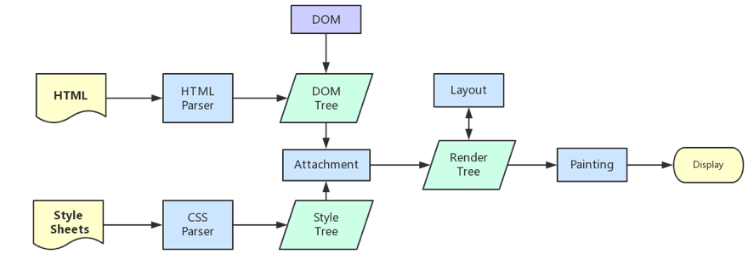

### 从 URL 输入到页面展现到底发生什么？

> URL（Uniform Resource Locator），统一资源定位符，用于定位互联网上资源，俗称网址。

#### 一、DNS 解析:将域名解析成 IP 地址

> 浏览器并不能直接通过域名找到对应的服务器, 在浏览器输入网址后，要经过域名解析通过查找 IP 地址找到对应的服务器。浏览器通过向 DNS 服务器发送域名，DNS 服务器查询到与域名相对应的 IP 地址，然后返回给浏览器，浏览器再将 IP 地址打在协议上，同时请求参数也会在协议搭载，然后一并发送给对应的服务器。

##### 1. IP地址

IP 地址是指互联网协议地址，IP 地址是 IP 协议提供的一种统一的地址格式，它为互联网上的每一个网络和每一台主机分配一个逻辑地址，以此来屏蔽物理地址的差异。

IP 地址是一个 32 位的二进制数，比如 127.0.0.1 为本机 IP

域名：便于记忆和沟通的一组服务器的地址，更符合人类记忆与理解的一种方式

IP： 计算机理解的一种方式

所以域名解析就是把一种把人类理解的地址（域名）转换成一种计算机理解的语言（IP）

##### 2. 域名解析

DNS 协议提供通过域名查找 IP 地址，或逆向从 IP 地址反查域名的服务。DNS 是一个网络服务器，我们的域名解析简单来说就是在 DNS 上记录一条信息记录

##### 3. 浏览器如何通过域名去查询 URL 对应的 IP 呢

+ 浏览器缓存：浏览器会按照一定的频率缓存 DNS 记录。

+ 操作系统缓存：如果浏览器缓存中找不到需要的 DNS 记录，那就去操作系统中找

+ 路由缓存：路由器也有 DNS 缓存。

+ ISP 的 DNS 服务器：ISP 是互联网服务提供商的简称，ISP 有专门的 DNS 服务器应对 DNS 查询请求

+ 根服务器：ISP 的 DNS 服务器还找不到的话，它就会向根服务器发出请求，进行递归查询（DNS 服务器先问根域名服务器.com 域名服务器的 IP 地址，然后再问.baidu 域名服务器，依次类推）

#### 二、TCP 连接：TCP 三次握手

刚开始客户端处于 closed 的状态，服务端处于 listen 状态。然后

1. 第一次握手：客户端给服务端发一个 SYN 报文，并指明客户端的初始化序列号 ISN(c)。此时客户端处于 SYN_Send 状态

2. 第二次握手：服务器收到客户端的 SYN 报文之后，会以自己的 SYN 报文作为应答，并且也是指定了自己的初始化序列号 ISN(s)，同时会把客户端的 ISN + 1 作为 ACK 的值，表示自己已经收到了客户端的 SYN，此时服务器处于 SYN_REVD 的状态

3. 第三次握手：客户端收到 SYN 报文之后，会发送一个 ACK 报文，当然，也是一样把服务器的 ISN + 1 作为 ACK 的值，表示已经收到了服务端的 SYN 报文，此时客户端处于 establised 状态

4. 服务器收到 ACK 报文之后，也处于 establised 状态，此时，双方以建立起了链接

**面试问题**

1. 为啥只有三次握手才能确认双方的接受与发送能力是否正常，而两次却不可以？

  第一次握手：客户端发送网络包，服务端收到了。这样服务端就能得出结论：客户端的发送能力、服务端的接收能力是正常的

  第二次握手：服务端发包，客户端收到了。这样客户端就能得出结论：服务端的接收、发送能力，客户端的接收、发送能力是正常的。不过此时服务器并不能确认客户端的接收能力是否正常

  第三次握手：客户端发包，服务端收到了。这样服务端就能得出结论：客户端的接收、发送能力正常，服务器自己的发送、接收能力也正常

2. （ISN）是固定的吗？

  三次握手的一个重要功能是客户端和服务端交换ISN(Initial Sequence Number), 以便让对方知道接下来接收数据的时候如何按序列号组装数据。

  如果ISN是固定的，攻击者很容易猜出后续的确认号，因此 ISN 是动态生成的。

3. 什么是半连接队列

  服务器第一次收到客户端的 SYN 之后，就会处于 SYN_RCVD 状态，此时双方还没有完全建立其连接，服务器会把此种状态下请求连接放在一个队列里，我们把这种队列称之为半连接队列。当然还有一个全连接队列，就是已经完成三次握手，建立起连接的就会放在全连接队列中。如果队列满了就有可能会出现丢包现象。

4. SYN-ACK 重传次数的问题

  服务器发送完SYN－ACK包，如果未收到客户确认包，服务器进行首次重传，等待一段时间仍未收到客户确认包，进行第二次重传，如果重传次数超 过系统规定的最大重传次数，系统将该连接信息从半连接队列中删除。注意，每次重传等待的时间不一定相同，一般会是指数增长，例如间隔时间为 1s, 2s, 4s, 8s, ....

5. 三次握手过程中可以携带数据吗

  很多人可能会认为三次握手都不能携带数据，其实第三次握手的时候，是可以携带数据的。也就是说，第一次、第二次握手不可以携带数据，而第三次握手是可以携带数据的
  此时客户端已经处于 established 状态，也就是说，对于客户端来说，他已经建立起连接了，并且也已经知道服务器的接收、发送能力是正常的了，所以能携带数据页没啥毛病

6. 三次握手的作用
  1、确认双方的接受能力、发送能力是否正常。

  2、指定自己的初始化序列号，为后面的可靠传送做准备。

  3、如果是 https 协议的话，三次握手这个过程，还会进行数字证书的验证以及加密密钥的生成到。

  4、为了防止已失效的连接请求报文段突然又传送到了服务端，因而产生错误

#### 三、发送 HTTP 请求

> TCP 三次握手结束后, 开始发送 HTTP 请求报文, 请求报文由请求行（request line）、请求头（header）、请求体组成
 
1. 请求行包含请求方法、URL、协议版本

  + 请求方法包含 8 种：GET、POST、PUT、DELETE、PATCH、HEAD、OPTIONS、TRACE
  + URL 即请求地址，由 <协议>：//<主机>：<端口>/<路径>?<参数> 组成
  + 协议版本即 http 版本号

```js
POST /chapter17/user.html HTTP/1.1
```

2. 请求头包含请求的附加信息，由关键字/值对组成，每行一对，关键字和值用英文冒号“:”分隔

  请求头部通知服务器有关于客户端请求的信息。它包含许多有关的客户端环境和请求正文的有用信息。其中比如：Host，表示主机名，虚拟主机；Connection,HTTP/1.1 增加的，使用 keepalive，即持久连接，一个连接可以发多个请求；User-Agent，请求发出者，兼容性以及定制化需求。

3. 请求体，可以承载多个请求参数的数据，包含回车符、换行符和请求数据，并不是所有请求都具有请求数据

#### 四、 服务器处理请求并返回 HTTP 报文

##### 1. 服务器

每台服务器上都会安装处理请求的应用——web server。常见的 web server 产品有 apache、nginx、IIS 或 Lighttpd 等。
web server 担任管控的角色，对于不同用户发送的请求，会结合配置文件，把不同请求委托给服务器上处理相应请求的程序进行处理（例如 CGI 脚本，JSP 脚本，servlets，ASP 脚本，服务器端 JavaScript，或者一些其它的服务器端技术等），然后返回后台程序处理产生的结果作为响应。

##### 2. MVC后台处理

后台开发现在有很多框架，但大部分都还是按照 MVC 设计模式进行搭建的。
MVC 是一个设计模式，将应用程序分成三个核心部件：模型（model）-- 视图（view）--控制器（controller），它们各自处理自己的任务，实现输入、处理和输出的分离。

  1. 视图: 它是提供给用户的操作界面，是程序的外壳。

  2. 模型: 模型主要负责数据交互。在 MVC 的三个部件中，模型拥有最多的处理任务。一个模型能为多个视图提供数据。

  3. 控制器（controller）

   它负责根据用户从"视图层"输入的指令，选取"模型层"中的数据，然后对其进行相应的操作，产生最终结果。控制器属于管理者角色，从视图接收请求并决定调用哪个模型构件去处理请求，然后再确定用哪个视图来显示模型处理返回的数据。

这三层是紧密联系在一起的，但又是互相独立的，每一层内部的变化不影响其他层。每一层都对外提供接口，供上面一层调用。
首先浏览器发送过来的请求先经过控制器，控制器进行逻辑处理和请求分发，接着会调用模型，这一阶段模型会获取 redis db 以及 MySQL 的数据，获取数据后将渲染好的页面，响应信息会以响应报文的形式返回给客户端，最后浏览器通过渲染引擎将网页呈现在用户面前。

##### 3. http 响应报文

响应报文由响应行（request line）、响应头部（header）、响应主体三个部分组成

#### 五、 浏览器解析渲染页面



浏览器解析渲染页面分为一下五个步骤：

+ 根据 HTML 解析出 DOM 树

  根据 HTML 的内容，将标签按照结构解析成为 DOM 树，DOM 树解析的过程是一个深度优先遍历。即先构建当前节点的所有子节点，再构建下一个兄弟节点。
  在读取 HTML 文档，构建 DOM 树的过程中，若遇到 script 标签，则 DOM 树的构建会暂停，直至脚本执行完毕。

+ 根据 CSS 解析生成 CSS 规则树

  解析 CSS 规则树时 js 执行将暂停，直至 CSS 规则树就绪。
  浏览器在 CSS 规则树生成之前不会进行渲染。
  
+ 结合 DOM 树和 CSS 规则树，生成渲染树

  DOM 树和 CSS 规则树全部准备好了以后，浏览器才会开始构建渲染树。
  精简 CSS 并可以加快 CSS 规则树的构建，从而加快页面相应速度。

+ 根据渲染树计算每一个节点的信息(布局)

  布局：通过渲染树中渲染对象的信息，计算出每一个渲染对象的位置和尺寸
  回流：在布局完成后，发现了某个部分发生了变化影响了布局，那就需要倒回去重新渲染。  

+ 根据计算好的信息绘制页面

  绘制阶段，系统会遍历呈现树，并调用呈现器的“paint”方法，将呈现器的内容显示在屏幕上。
  重绘：某个元素的背景颜色，文字颜色等，不影响元素周围或内部布局的属性，将只会引起浏览器的重绘。
  回流：某个元素的尺寸发生了变化，则需重新计算渲染树，重新渲染。

#### 六、断开连接：TCP 四次挥手

刚开始双方都处于 establised 状态，假如是客户端先发起关闭请求，则：

1. 第一次挥手：客户端发送一个 FIN 报文，报文中会指定一个序列号。此时客户端处于FIN_WAIT1状态。

2. 第二次握手：服务端收到 FIN 之后，会发送 ACK 报文，且把客户端的序列号值 + 1 作为 ACK 报文的序列号值，表明已经收到客户端的报文了，此时服务端处于 CLOSE_WAIT状态。

3. 第三次挥手：如果服务端也想断开连接了，和客户端的第一次挥手一样，发给 FIN 报文，且指定一个序列号。此时服务端处于 LAST_ACK 的状态。

4. 第四次挥手：客户端收到 FIN 之后，一样发送一个 ACK 报文作为应答，且把服务端的序列号值 + 1 作为自己 ACK 报文的序列号值，此时客户端处于 TIME_WAIT 状态。需要过一阵子以确保服务端收到自己的 ACK 报文之后才会进入 CLOSED 状态

5. 服务端收到 ACK 报文之后，就处于关闭连接了，处于 CLOSED 状态。

**面试重点：状态**

1. TIME_WAIT，为什么客户端发送 ACK 之后不直接关闭，而是要等一阵子才关闭?

    这其中的原因就是，要确保服务器是否已经收到了我们的 ACK 报文，如果没有收到的话，服务器会重新发 FIN 报文给客户端，客户端再次收到 ACK 报文之后，就知道之前的 ACK 报文丢失了，然后再次发送 ACK 报文。至于 TIME_WAIT 持续的时间至少是一个报文的来回时间。一般会设置一个计时，如果过了这个计时没有再次收到 FIN 报文，则代表对方成功就是 ACK 报文，此时处于 CLOSED 状态。

2. 状态码


    LISTEN - 侦听来自远方TCP端口的连接请求；


    SYN-SENT -在发送连接请求后等待匹配的连接请求；


    SYN-RECEIVED - 在收到和发送一个连接请求后等待对连接请求的确认；


    ESTABLISHED- 代表一个打开的连接，数据可以传送给用户；


    FIN-WAIT-1 - 等待远程TCP的连接中断请求，或先前的连接中断请求的确认；


    FIN-WAIT-2 - 从远程TCP等待连接中断请求；


    CLOSE-WAIT - 等待从本地用户发来的连接中断请求；


    CLOSING -等待远程TCP对连接中断的确认；


    LAST-ACK - 等待原来发向远程TCP的连接中断请求的确认；


    TIME-WAIT -等待足够的时间以确保远程TCP接收到连接中断请求的确认；


    CLOSED - 没有任何连接状态；

原文地址：

[url](https://segmentfault.com/a/1190000017184701)

[三次握手四次挥手](https://segmentfault.com/a/1190000017184701)