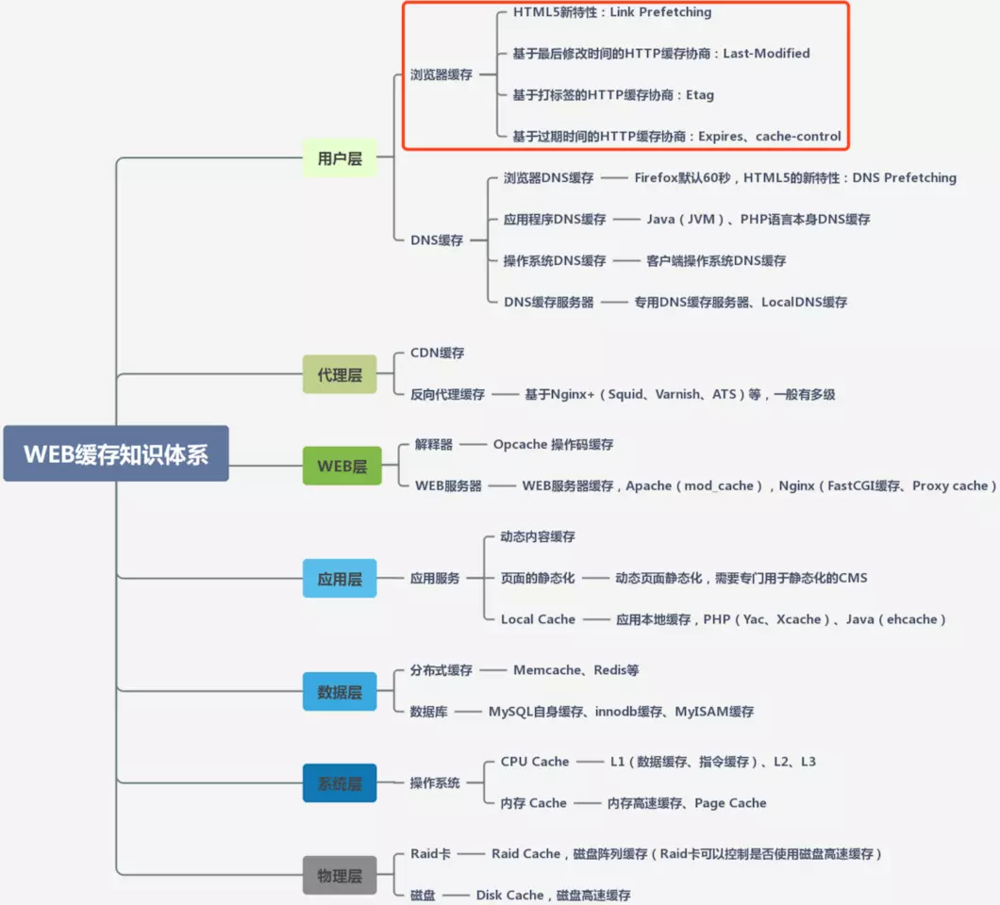
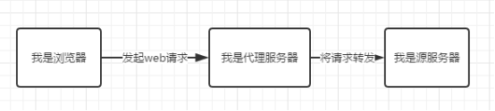
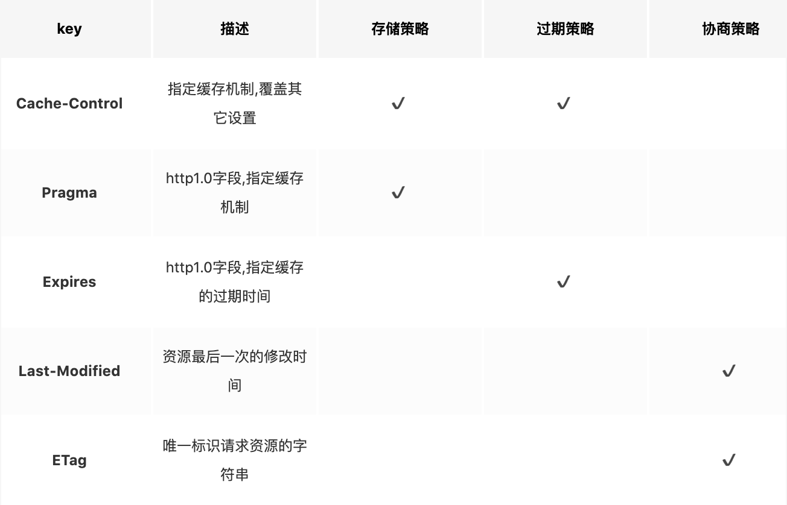
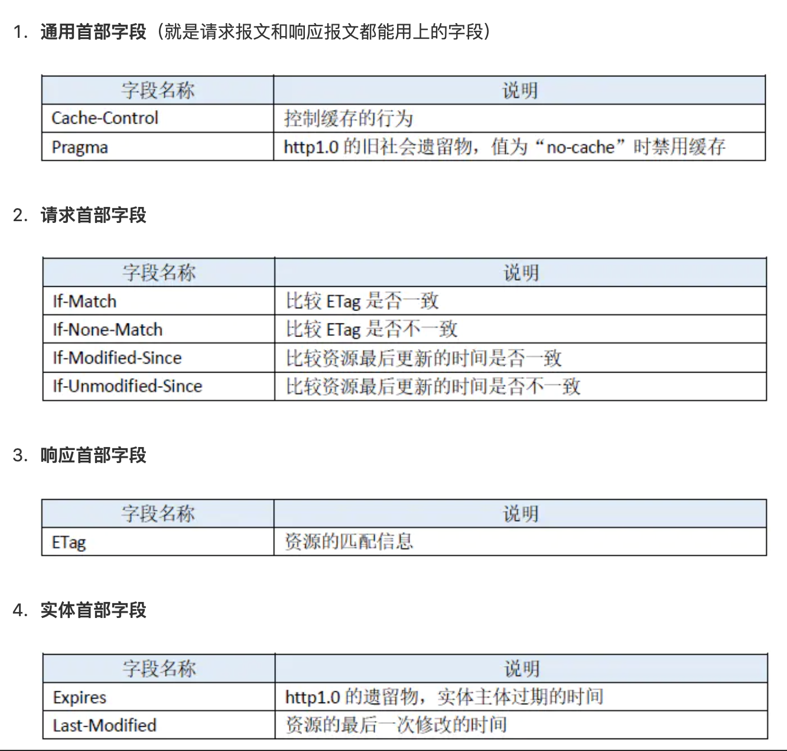
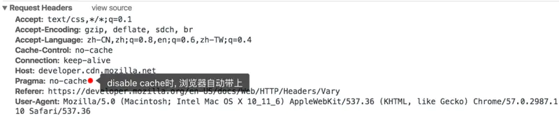
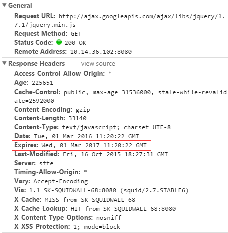
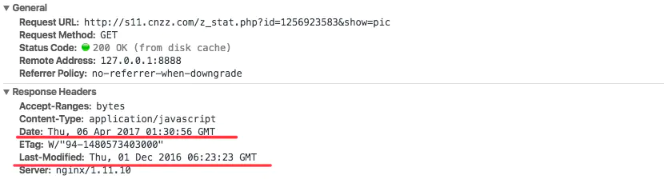
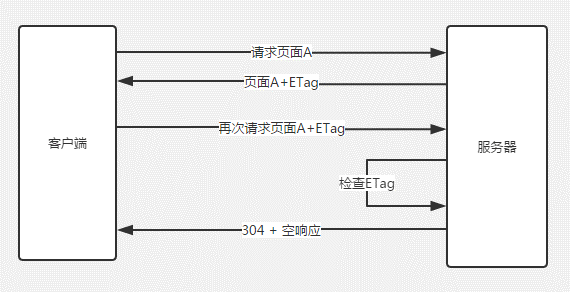
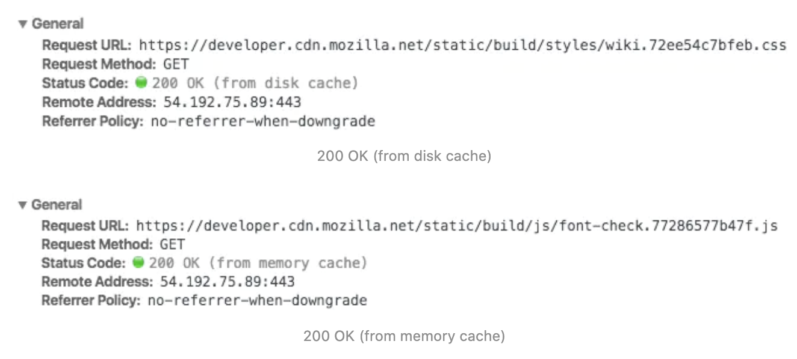

### 缓存

在实际WEB开发过程中，缓存技术会涉及到不同层、不同端，比如：用户层、系统层、代理层、前端、后端、服务端等，每一层的缓存目标都是一致的，就是尽快返回请求数据、减少延迟，但每层使用的技术实现是各有不同，面对不同层、不同端的优劣，选用不同的技术来提升系统响应效率。所以，我们首先看下各层的缓存都有哪些技术，都缓存哪些数据，从整体上，对WEB的缓存技术进行了解，如下图所示：



#### 浏览器缓存

浏览器通过代理服务器向源服务器发送请求的原理如下图： 



浏览器先向代理服务器发起Web请求，再将请求转发到源服务器。它属于共享缓存，所以很多地方都可以使用其缓存资源，因此对于节省流量有很大作用。

```浏览器缓存是将文件保存在客户端```，在同一个会话过程中会检查缓存的副本是否足够新，在后退网页时，访问过的资源可以从浏览器缓存中拿出使用。通过减少服务器处理请求的数量，用户将获得更快的体验。

#### http header中缓存有关的key




```浏览器缓存是由header决定的，header的参数一共有四种```

#### 一、 Cache-Control（重要策略）

浏览器缓存里, Cache-Control是金字塔顶尖的规则```（优先级最高）```, 它藐视一切其他设置, 只要其他设置与其抵触, 一律覆盖之.

不仅如此, 它还是一个复合规则, 包含多种值, 横跨 ```存储策略, 过期策略``` 两种, 同时在```请求头和响应头```都可设置.

##### 缓存协商策略用于重新验证缓存资源是否有效, 有关的key如下.

| 字段 | 描述 |  存储策略 |  过期策略  | 请求字段 |  响应字段 | 
|  -  |  -  |  -       |  -       |  -      | -        | 
|  public   |  资源将被客户端和代理服务器缓存 |  ✔️ |   |  |  ✔️| 
|  private  |  资源仅被客户端缓存, 代理服务器不缓存 | ✔️ |  |  | ✔️ | 
|  no-store | 请求和响应都不缓存 | ✔️ |  | ✔️ | ✔️ | 
|  no-cache | 相当于max-age:0,must-revalidate即资源被缓存, 但是缓存立刻过期, 同时下次访问时强制验证资源有效性|  ✔️ | ✔️| ✔️| ✔️| 
|  max-age  | 缓存资源, 但是在指定时间(单位为秒)后缓存过期，max-age会覆盖掉Expires | ✔️ | ✔️ | ✔️ | ✔️ | 
|  s-maxage | 同上, 依赖public设置, 覆盖max-age和Expires header, 且只在代理服务器上有效. | ✔️ | ✔️ |  | ✔️ | 
|  max-stale | 指定时间内, 即使缓存过时, 资源依然有效，响应将返回110(Response is stale)状态 | | ✔️ | ✔️| | 
|  min-fresh | 缓存的资源至少要保持指定时间的新鲜期 | | ✔️ | ✔️ | | 
|  must-revalidation / proxy-revalidation | 如果缓存失效, 强制重新向服务器(或代理)发起验证(因为max-stale等字段可能改变缓存的失效时间)|  | ✔️|  |  ✔️| 
|  only-if-cached | 仅仅返回已经缓存的资源, 不访问网络, 若无缓存则返回504 |  |  | ✔️|  | 
|  no-transform   | 强制要求代理服务器不要对资源进行转换, 禁止代理服务器对 Content-Encoding, Content-Range, Content-Type字段的修改(因此代理的gzip压缩将不被允许) | | | ✔️| ✔️| 

注： 客户端总是采用最保守的缓存策略，当max-age 与 max-stale 和 min-fresh 同时使用时, 它们的设置相互之间```独立生效```, 最为保守的缓存策略总是有效.


#### 二、pragma

http1.0字段，通常设置为 ```pragma: no-cache```，作用同```cache-control: no-cache```，当一个no-cache请求发送给一个不遵循Http/1.1的服务器时，客户端应该包含pragma，指令. 为此, 勾选☑️ 上disable cache时, 浏览器自动带上了pragma字段. 如下:




#### 三、 Expires（缓存过期时间）

```js
  Expires: Wed, 05 Apr 2017 00:55:35 GMT
```
 

缓存过期时间，用来指定```资源到期的时间，是服务器端的具体的时间点```, 其优先级比 ```Cache-Control:max-age``` 低, 两者同时出现在响应头时,``` Expires```将被后者覆盖. Expires是Web服务器响应消息头字段，在响应http请求时告诉浏览器在过期时间前浏览器可以直接从浏览器缓存取数据，而无需再次请求。如果```Expires, Cache-Control: max-age, 或 Cache-Control:s-maxage``` 都没有在响应头中出现, 并且也没有其它缓存的设置, 那么浏览器默认会采用一个```启发式的算法```, 通常会取响应头的```Date_value - Last-Modified_value```值的```10%```作为缓存时间.

如下资源便采取了启发式缓存算法.



其缓存时间为 (Date_value - Last-Modified_value) * 10%, 计算如下:

```js

  const Date_value = new Date('Thu, 06 Apr 2017 01:30:56 GMT').getTime();
  const LastModified_value = new Date('Thu, 01 Dec 2016 06:23:23 GMT').getTime();
  const cacheTime = (Date_value - LastModified_value) / 10;
  const Expires_timestamp = Date_value + cacheTime;
  const Expires_value = new Date(Expires_timestamp);
  console.log('Expires:', Expires_value); // Expires: Tue Apr 18 2017 23:25:41 GMT+0800 (CST)

```

#### 四、 Etag

实体标签, 服务器资源的唯一标识符, 浏览器可以根据ETag值缓存数据, 节省带宽. 如果资源已经改变, etag可以帮助防止同步更新资源的相互覆盖. ETag 优先级比 Last-Modified 高.

服务器会根据请求的实体内容生成一个hash串，标识资源的状态，下一次请求的时候会带上这一个hash串，服务器验证这个资源有咩有被修改，如果没有修改如下图：



使用ETag可以解决Last-modified存在的一些问题：

+ 某一些服务器记录的最后修改时间不是特别的准确，这样就没有办法根据最后修改时间准确的判断资源是否更新
+ 如果资源修改特别频繁，操作时间是s以下级别的，那么服务器就不能准确的记录时间了Last-modified只能精确到秒
+ 一些资源的内容没有被修改，但是最后的修改时间却被修改的，Etag会视其没有修改

#### 五、If-Match

语法: If-Match: ETag_value 或者 If-Match: ETag_value, ETag_value, …

缓存校验字段, 其值为上次收到的一个或多个etag 值. 常用于判断条件是否满足, 如下两种场景:

+ 对于 GET 或 HEAD 请求, 结合 Range 头字段, 它可以保证新范围的请求和前一个来自相同的源, 如果不匹配, 服务器将返回一个416(Range Not Satisfiable)状态码的响应.

+ 对于 PUT 或者其他不安全的请求, If-Match 可用于阻止错误的更新操作, 如果不匹配, 服务器将返回一个412(Precondition Failed)状态码的响应.

#### 六、 If-None-Match

语法: If-None-Match: ETag_value 或者 If-None-Match: ETag_value, ETag_value, …

缓存校验字段, 结合ETag字段, 常用于判断缓存资源是否有效, 优先级比If-Modified-Since高.

+ 对于 GET 或 HEAD 请求, 如果其etags列表均不匹配, 服务器将返回200状态码的响应, 反之, 将返回304(Not Modified)状态码的响应. 无论是200还是304响应, 都至少返回 Cache-Control, Content-Location, Date, ETag, Expires, and Vary 中之一的字段.

+ 对于其他更新服务器资源的请求, 如果其etags列表匹配, 服务器将执行更新, 反之, 将返回412(Precondition Failed)状态码的响应.

#### 七、 Last-Modified（最后修改时间）

语法: Last-Modified: 星期,日期 月份 年份 时:分:秒 GMT


服务器端文件最后的修改时间，需要和cache-control一同使用，是检查服务器资源是否修改的一种手段。

当浏览器再次进行请求的时候，会向服务器发送```If-modified-since```报头，询问```Last-Modified```时间点之后服务器会判断资源最后一次的修改时间，如果```没有发生改变就返回304，使用缓存```，如果```有修改，就重新向服务器发起请求```，返回码和首次请求相同为200，资源为服务器最新资源。

```js
  Last-Modified: Tue, 04 Apr 2017 10:01:15 GMT
```

+ 用于标记请求资源的最后一次修改时间, 格式为GMT(格林尼治标准时间). 如可用 new Date().toGMTString()获取当前GMT时间.
  
+ Last-Modified 是 ETag 的fallback机制, 优先级比 ETag 低, 且只能精确到秒, 因此不太适合短时间内频繁改动的资源. 不仅如此, 服务器端的静态资源, 通常需要编译打包, 可能出现资源内容没有改变, 而Last-Modified却改变的情况.

#### 八、 If-Modified-Since

语法同上, 如:

```js
  If-Modified-Since: Tue, 04 Apr 2017 10:12:27 GMT
```
缓存校验字段, 其值为上次响应头的Last-Modified值, 若与请求资源当前的Last-Modified值相同, 那么将返回304状态码的响应, 反之, 将返回200状态码响应.

#### 九、If-Unmodified-Since

缓存校验字段, 语法同上. 表示资源未修改则正常执行更新, 否则返回412(Precondition Failed)状态码的响应. 常用于如下两种场景:

+ 不安全的请求, 比如说使用post请求更新wiki文档, 文档未修改时才执行更新.
+ 与 If-Range 字段同时使用时, 可以用来保证新的片段请求来自一个未修改的文档.

#### 浏览器缓存机制

根据上面四种类型的首部字段不同使用策略，浏览器中缓存可分为强缓存和协商缓存：

+ 浏览器在加载资源时，先根据这个资源的一些http header判断它是否命中强缓存，强缓存如果命中，浏览器直接从自己的缓存中读取资源，不会发请求到服务器。比如：某个css文件，如果浏览器在加载它所在的网页时，这个css文件的缓存配置命中了强缓存，浏览器就直接从缓存中加载这个css，连请求都不会发送到网页所在服务器；
+ 当强缓存没有命中的时候，浏览器一定会发送一个请求到服务器，通过服务器端依据资源的另外一些http header验证这个资源是否命中协商缓存，如果协商缓存命中，服务器会将这个请求返回，但是不会返回这个资源的数据，而是告诉客户端可以直接从缓存中加载这个资源，于是浏览器就又会从自己的缓存中去加载这个资源；
+ 强缓存与协商缓存的共同点是：如果命中，都是从客户端缓存中加载资源，而不是从服务器加载资源数据；区别是：强缓存不发请求到服务器，协商缓存会发请求到服务器。
+ 当协商缓存也没有命中的时候，浏览器直接从服务器加载资源数据。

#### 浏览器缓存机制 - 强缓存

一旦资源命中强缓存, 浏览器便不会向服务器发送请求, 而是直接读取缓存. Chrome下的现象是``` 200 OK (from disk cache) ```或者 ```200 OK (from memory cache)```. 如下:

> 强缓存是利用Expires或者Cache-Control这两个http response header实现的，它们都用来表示资源在客户端缓存的有效期。

```Expires```是HTTP 1.0提出的一个表示资源过期时间的header，它描述的是一个绝对时间，由服务器返回，用GMT格式的字符串表示，如：Expires:Thu, 31 Dec 2037 23:55:55 GMT，```包含了Expires头标签的文件，就说明浏览器对于该文件缓存具有非常大的控制权```。

例如，一个文件的Expires值是2020年的1月1日，那么就代表，在2020年1月1日之前，浏览器都可以直接使用该文件的本地缓存文件，而不必去服务器再次请求该文件，哪怕服务器文件发生了变化。

所以，```Expires是优化中最理想的情况，因为它根本不会产生请求```，所以后端也就无需考虑查询快慢。它的缓存原理，如下：

 + 1. 浏览器第一次跟服务器请求一个资源，服务器在返回这个资源的同时，在response的header加上Expires的header
 + 2. 浏览器在接收到这个资源后，会把这个资源连同所有response header一起缓存下来（所以缓存命中的请求返回的header并不是来自服务器，而是来自之前缓存的header）；
 + 3. 浏览器再请求这个资源时，先从缓存中寻找，找到这个资源后，拿出它的Expires跟当前的请求时间比较，如果请求时间在Expires指定的时间之前，就能命中缓存，否则就不行；
 + 4. 如果缓存没有命中，浏览器直接从服务器加载资源时，Expires Header在重新加载的时候会被更新；

```Expires是较老的强缓存管理header```，由于它是服务器返回的一个```绝对时间```，在服务器时间与客户端时间```相差较大```时，缓存管理容易出现问题，比如：随意修改下客户端时间，就能影响缓存命中的结果。所以在HTTP 1.1的时候，提出了一个新的header，就是```Cache-Control```，这是一个相对时间，在配置缓存的时候，以```秒```为单位，用数值表示，如：Cache-Control:max-age=315360000，它的缓存原理是:

+ 1. 浏览器第一次跟服务器请求一个资源，服务器在返回这个资源的同时，在response的header加上Cache-Control的header
+ 2. 浏览器在接收到这个资源后，会把这个资源连同所有response header一起缓存下来；
+ 3. 浏览器再请求这个资源时，先从缓存中寻找，找到这个资源后，根据它第一次的请求时间和Cache-Control设定的有效期，计算出一个资源过期时间，再拿这个过期时间跟当前的请求时间比较，如果请求时间在过期时间之前，就能命中缓存，否则就不行；
+ 4. 如果缓存没有命中，浏览器直接从服务器加载资源时，Cache-Control Header在重新加载的时候会被更新

```Cache-Control```描述的是一个相对时间，在进行缓存命中的时候，都是利用```客户端时间```进行判断，所以相比较Expires，Cache-Control的缓存管理更有效，安全一些。

此外，还可以为 ```Cache-Control``` 指定 ```public``` 或 ```private``` 标记。如果使用``` private```，则表示```该资源仅仅属于发出请求的最终用户```，这将禁止中间服务器（如代理服务器）缓存此类资源。对于包含用户个人信息的文件（如一个包含用户名的 HTML 文档），可以设置 private，一方面由于这些缓存对其他用户来说没有任何意义，另一方面用户可能不希望相关文件储存在不受信任的服务器上。需要指出的是，```private 并不会使得缓存更加安全，它同样会传给中间服务器```（如果网站对于传输的安全性要求很高，应该使用传输层安全措施）。对于 public，则允许所有服务器缓存该资源。通常情况下，对于所有人都可以访问的资源（例如网站的 logo、图片、脚本等），```Cache-Control 默认设为 public 是合理的```。



#### 浏览器缓存机制 - 协商缓存

当浏览器对某个资源的请求没有命中强缓存，就会发一个请求到服务器，验证协商缓存是否命中，如果协商缓存命中，请求响应返回的http状态为```304```并且会显示一个```Not Modified```的字符串,查看单个请求的Response Header，也能看到304的状态码和Not Modified的字符串，只要看到这个就可说明这个资源是命中了协商缓存，然后从客户端缓存中加载的，而不是服务器最新的资源：

> 协商缓存是利用的是【Last-Modified，If-Modified-Since】和【ETag、If-None-Match】这两对Header来管理的。

【Last-Modified，If-Modified-Since】的控制缓存的原理，如下：

+ 1. 浏览器第一次跟服务器请求一个资源，服务器在返回这个资源的同时，在response的header加上Last-Modified的header，这个header表示这个资源在服务器上的最后修改时间：
+ 2. 浏览器再次跟服务器请求这个资源时，在request的header上加上If-Modified-Since的header，这个header的值就是上一次请求时返回的Last-Modified的值：
+ 3. 服务器再次收到资源请求时，根据浏览器传过来If-Modified-Since和资源在服务器上的最后修改时间判断资源是否有变化，如果没有变化则返回304 Not Modified，但是不会返回资源内容；如果有变化，就正常返回资源内容。当服务器返回304 Not Modified的响应时，response header中不会再添加Last-Modified的header，因为既然资源没有变化，那么Last-Modified也就不会改变
+ 4. 浏览器收到304的响应后，就会从缓存中加载资源。
+ 5. 如果协商缓存没有命中，浏览器直接从服务器加载资源时，Last-Modified Header在重新加载的时候会被更新，下次请求时，If-Modified-Since会启用上次返回的Last-Modified值


```【Last-Modified，If-Modified-Since】```都是根据服务器时间返回的header，一般来说，```在没有调整服务器时间和篡改客户端缓存的情况下，这两个header配合起来管理协商缓存是非常可靠的，但是有时候也会服务器上资源其实有变化，但是最后修改时间却没有变化的情况```，而这种问题又很不容易被定位出来，而当这种情况出现的时候，就会影响协商缓存的可靠性。所以就有了另外一对header来管理协商缓存，这对header就是```【ETag、If-None-Match】```。它们的缓存管理的方式是：

+ 1.浏览器第一次跟服务器请求一个资源，服务器在返回这个资源的同时，在response的header加上ETag的header，这个header是服务器根据当前请求的资源生成的一个唯一标识，这个唯一标识是一个字符串，只要资源有变化这个串就不同，跟最后修改时间没有关系，所以能很好的补充Last-Modified的问题：
+ 2. 浏览器再次跟服务器请求这个资源时，在request的header上加上If-None-Match的header，这个header的值就是上一次请求时返回的ETag的值：
+ 3. 服务器再次收到资源请求时，根据浏览器传过来If-None-Match和然后再根据资源生成一个新的ETag，如果这两个值相同就说明资源没有变化，否则就是有变化；如果没有变化则返回304 Not Modified，但是不会返回资源内容；如果有变化，就正常返回资源内容。与Last-Modified不一样的是，当服务器返回304 Not Modified的响应时，由于ETag重新生成过，response header中还会把这个ETag返回，即使这个ETag跟之前的没有变化：
+ 4. 浏览器收到304的响应后，就会从缓存中加载资源

Etag和Last-Modified非常相似，都是用来判断一个参数，从而决定是否启用缓存。```但是ETag相对于Last-Modified也有其优势，可以更加准确的判断文件内容是否被修改，从而在实际操作中实用程度也更高```

协商缓存跟强缓存不一样，强缓存不发请求到服务器，```所以有时候资源更新了浏览器还不知道，但是协商缓存会发请求到服务器```，所以资源是否更新，服务器肯定知道。大部分web服务器都默认开启协商缓存，而且是同时启用【Last-Modified，If-Modified-Since】和【ETag、If-None-Match】，


缓存过期后, 继续请求该资源, 对于现代浏览器, 拥有如下两种做法:

+ 根据上次响应中的ETag_value, 自动往request header中添加If-None-Match字段. 服务器收到请求后, 拿If-None-Match字段的值与资源的ETag值进行比较, 若相同, 则命中协商缓存, 返回304响应.

+ 根据上次响应中的Last-Modified_value, 自动往request header中添加If-Modified-Since字段. 服务器收到请求后, 拿If-Modified-Since字段的值与资源的Last-Modified值进行比较, 若相同, 则命中协商缓存, 返回304响应.

以上, ETag优先级比Last-Modified高, 同时存在时, 前者覆盖后者. 下面通过实例来理解下强缓存和协商缓存.

#### Age

出现此字段, 表示命中```代理服务器```的缓存. 它指的是代理服务器对于请求资源的已缓存时间, 单位为```秒```. 如下:

```js

  Age:2383321
  Date:Wed, 08 Mar 2017 16:12:42 GMT

```

以上指的是, 代理服务器在2017年3月8日16:12:42时向源服务器发起了对该资源的请求, 目前已缓存了该资源2383321秒.

#### Date

指的是响应生成的时间. 请求经过代理服务器时, 返回的Date未必是最新的, 通常这个时候, 代理服务器将增加一个Age字段告知该资源已缓存了多久.

#### Vary

对于服务器而言, 资源文件可能不止一个版本, 比如说压缩和未压缩, 针对不同的客户端, 通常需要返回不同的资源版本. 比如说老式的浏览器可能不支持解压缩, 这个时候, 就需要返回一个未压缩的版本; 对于新的浏览器, 支持压缩, 返回一个压缩的版本, 有利于节省带宽, 提升体验. 那么怎么区分这个版本呢, 这个时候就需要Vary了.

服务器通过指定```Vary: Accept-Encoding```, 告知代理服务器, 对于这个资源, 需要缓存两个版本: 压缩和未压缩. 这样老式浏览器和新的浏览器, 通过代理, 就分别拿到了未压缩和压缩版本的资源, 避免了都拿同一个资源的尴尬.

```js
  Vary:Accept-Encoding,User-Agent
```

如上设置, 代理服务器将针对是否压缩和浏览器类型两个维度去缓存资源. 如此一来, 同一个url, 就能针对PC和Mobile返回不同的缓存内容.

#### 怎么让浏览器不缓存静态资源

实际上, 工作中很多场景都需要避免浏览器缓存, 除了浏览器隐私模式, 请求时想要禁用缓存, 还可以设置请求头: Cache-Control: no-cache, no-store, must-revalidate .
当然, 还有一种常用做法: 即给请求的资源增加一个版本号, 如下:

```js
  <link rel="stylesheet" type="text/css" href="../css/style.css?version=1.8.9"/>
```
这样做的好处就是你可以自由控制什么时候加载最新的资源.

不仅如此, HTML也可以禁用缓存, 即在页面的\节点中加入\标签, 代码如下:

```js
  <meta http-equiv="Cache-Control" content="no-cache, no-store, must-revalidate"/>
```

#### 使用缓存流程

还是用图说话，下面是我所总结的从浏览器请求到展示资源的过程（非常重要）：


1. ```Etag/If-None-Match```

Etag/If-None-Match也需要配合```cache-control```使用

```Etag```： 当web服务器响应请求时，告诉浏览器当前资源在服务器上当唯一标识（生成规则由服务器），aapache当中，Etag是对文件的索引节，大小和最后修改的时间的hash值

```If-None-Match```： 当资源过期的时候，（cache-control的max-age）还需要判断当前请求头是否具有Etag，如果有则再次向服务器发起请求并带有If-None-Match：Etag的hash值，web服务器收到请求后会将If-None-Match与资源的相应的校验串进行对比，决定返回200或304

2. ```Last-Modified/If-Modified-Since```

Last-Modified/If-Modified-Since要配合```Cache-Control```使用。

```lLast-Modified```：标示这个响应资源的最后修改时间。web服务器在响应请求时，告诉浏览器资源的最后修改时间。

```lIf-Modified-Since```：当资源过期时（使用Cache-Control标识的max-age），发现资源具有Last-Modified声明，则再次向web服务器请求时带上头If-Modified-Since，表示请求时间。web服务器收到请求后发现有头If-Modified-Since则与被请求资源的最后修改时间进行比对。若最后修改时间较新，说明资源又被改动过，则响应整片资源内容（写在响应消息包体内），HTTP 200；若最后修改时间较旧，说明资源无新修改，则响应HTTP 304 (无需包体，节省浏览)，告知浏览器继续使用所保存的cache。

3. 既生Last-Modified何生Etag？（```Etag优先级高于Last-modified```）
   
  你可能会觉得使用Last-Modified已经足以让浏览器知道本地的缓存副本是否足够新，为什么还需要Etag（实体标识）呢？HTTP1.1中Etag的出现主要是为了解决几个Last-Modified比较难解决的问题：

  1. Last-Modified标注的最后修改只能精确到秒级，如果某些文件在1秒钟以内，被修改多次的话，它将不能准确标注文件的修改时间
  2. 如果某些文件会被定期生成，当有时内容并没有任何变化，但Last-Modified却改变了，导致文件没法使用缓存
  3. 有可能存在服务器没有准确获取文件修改时间，或者与代理服务器时间不一致等情形
   
  Etag是服务器自动生成或者由开发者生成的对应资源在服务器端的唯一标识符，能够更加准确的控制缓存。Last-Modified与ETag是可以一起使用的，服务器会优先验证ETag，一致的情况下，才会继续比对Last-Modified，最后才决定是否返回304。

#### cache-control指令使用


#### 额外的缓存方式：LocalStorage和sessionStorage 

除了开头提到的那么多缓存方式以外，还有一种我们都熟悉的缓存方式，```LocalStorage和sessionStorage```

```LocalStorage```是一种本地存储的公共资源，域名下很多应用共享这份资源会有风险；LocalStorage是以页面域名划分的，如果有多个等价域名之间的LocalStorage不互通，则会造成缓存多份浪费。

LocalStorage在PC上的兼容性不太好，而且当网络速度快、协商缓存响应快时使用localStorage的速度比不上304。并且不能缓存css文件。而移动端由于网速慢，使用localStorage要快于304。

而相对LocalStorage来说，```SessionStorage```的数据只存储到特定的会话中，```不属于持久化的存储```，所以关闭浏览器会清除数据。和localstorage具有相同的方法。


####  IE8的异常表现

实际上, 上述缓存有关的规律, 并非所有浏览器都完全遵循. 比如说IE8.

资源缓存是否有效相关.

| 浏览器|	前提|	操作|	表现|	正常表现|
|-|-|-|-|-|
|IE8|	资源缓存有效|	新开一个窗口加载网页|	重新发送请求(返回200)	|展示缓存的页面|
|IE8|	资源缓存失效|	原浏览器窗口中单击 Enter 按钮	展示缓存的页面|	重新发送请求(返回200)|

Last-Modified / E-Tag 相关.

| 浏览器|	前提|	操作|	表现|	正常表现|
|-|-|-|-|-|
|IE8 |资源内容没有修改 |新开一个窗口加载网页| 浏览器重新发送请求(返回200) |重新发送请求(返回304)、
|IE8|资源内容已修改|原浏览器窗口中单击 Enter 按钮|浏览器展示缓存的页面|重新发送请求(返回200)

[浏览器缓存机制剖析](https://juejin.im/post/58eacff90ce4630058668257)

[前端优化：浏览器缓存技术介绍](https://juejin.im/post/5b9346dcf265da0aac6fbe57)