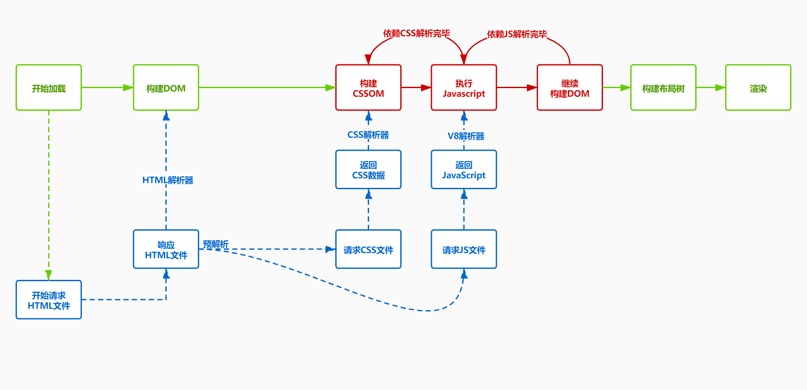

# 浏览器相关的面试题

## 1. get和post之间的区别

1. GET方法的参数应该放在url中，POST方法参数应该放在body中
2. 两者都是使用HTTP协议，在网络上是`明文`传输的，只要在网络节点上抓包，就能完整地获取数据报文，所以从传输的角度来说get和post都是不安全的，post比get更安全的地方在于post的参数不会被保存在浏览器历史或web服务器日志中
3. （大多数）浏览器通常都会限制url长度在2K个字节，而（大多数）服务器最多处理64K大小的url
4. GET用于获取信息，是无副作用的，是幂等的，且可缓存；POST用于修改服务器上的数据，有副作用，非幂等，不可自动缓存

## 2. 从 URL 输入到页面展现到底发生什么？

1. 用户输入的是关键字会交给浏览器的默认搜索引擎生产URL，如果是url客户端会进行DNS解析将域名解析成IP地址
2. 客户端利用TCP协议与服务器端进行三次握手连接
3. 握手结束之后客户端会向客户端开始发送 HTTP 请求报文
4. 服务器端处理请求并返回 HTTP 报文
5. 客户端会根据返回的信息解析渲染页面
6. 客户端利用TCP协议与服务器端四次挥手断开连接
   
## 3. DNS如何将域名解析成IP地址？

## 4. 浏览器如何通过域名去查询URL对应的IP呢？

浏览器会按照一定的频率缓存DNS记录，首先去浏览器缓存当中拿取，如果没有去操作系统中找缓存，如果没有取路由缓存，如果没有取互联网服务提供商(ISP)DNS服务器，如果没有会向根服务器发出请求，进行递归查询（DNS 服务器先问根域名服务器.com 域名服务器的 IP 地址，然后再问.baidu 域名服务器，依次类推）

## 5. TCP如何进行三次握手？

刚开始客户端处于 closed 的状态，服务端处于 listen 状态。然后

1. 第一次握手：客户端给服务端发一个 SYN 报文，并指明客户端的初始化序列号 ISN(c)。此时客户端处于 SYN_Send 状态
2. 第二次握手：服务器收到客户端的 SYN 报文之后，会以自己的 SYN 报文作为应答，并且也是指定了自己的初始化序列号 ISN(s)，同时会把客户端的 ISN + 1 作为 ACK 的值，表示自己已经收到了客户端的 SYN，此时服务器处于 SYN_REVD 的状态
3. 第三次握手：客户端收到 SYN 报文之后，会发送一个 ACK 报文，当然，也是一样把服务器的 ISN + 1 作为 ACK 的值，表示已经收到了服务端的 SYN 报文，此时客户端处于 establised 状态
4. 服务器收到 ACK 报文之后，也处于 establised 状态，此时，双方以建立起了链接

## 6. 为啥只有三次握手才能确认双方的接受与发送能力是否正常，而两次却不可以？

第一次握手：客户端发送网络包，服务端收到了。这样服务端就能得出结论：客户端的发送能力、服务端的接收能力是正常的

第二次握手：服务端发包，客户端收到了。这样客户端就能得出结论：服务端的接收、发送能力，客户端的接收、发送能力是正常的。不过此时服务器并不能确认客户端的接收能力是否正常

第三次握手：客户端发包，服务端收到了。这样服务端就能得出结论：客户端的接收、发送能力正常，服务器自己的发送、接收能力也正常

## 7. （ISN）是固定的吗？

不是，是动态生成的，三次握手是为了方便让对方知道接下来接收数据的时候如何按序列号组装数据，如果ISN是固定的，攻击者很容易猜出后续的确认号，有安全问题

## 8. 什么是半连接队列？

服务器第一次收到客户端的 SYN 之后，就会处于 SYN_RCVD 状态，此时双方还没有完全建立其连接，服务器会把此种状态下请求连接放在一个队列里，我们把这种队列称之为半连接队列。当然还有一个全连接队列，就是已经完成三次握手，建立起连接的就会放在全连接队列中。如果队列满了就有可能会出现丢包现象。

## 9. SYN-ACK 重传次数的问题？

服务器发送完SYN－ACK包，如果未收到客户确认包，服务器进行首次重传，等待一段时间仍未收到客户确认包，进行第二次重传，如果重传次数超 过系统规定的最大重传次数，系统将该连接信息从半连接队列中删除。注意，每次重传等待的时间不一定相同，一般会是指数增长，例如间隔时间为 1s, 2s, 4s, 8s, ....

## 10. 三次握手过程中可以携带数据吗？

第三次握手的时候，是可以携带数据的。第一次、第二次握手不可以携带数据，因为此时客户端已经处于 established 状态对于客户端来说，他已经建立起连接了，并且也已经知道服务器的接收、发送能力是正常的了，所以能携带数据页没啥毛病

## 11.TCP三次握手的作用?

1、确认双方的接受能力、发送能力是否正常。

2、指定自己的初始化序列号，为后面的可靠传送做准备。

3、如果是 https 协议的话，三次握手这个过程，还会进行数字证书的验证以及加密密钥的生成到。

4、为了防止已失效的连接请求报文段突然又传送到了服务端，因而产生错误

## 12. HTTP请求1.1当中请求方法有多少种？

请求方法包含8种：GET、POST、PUT、DELETE、PATCH、HEAD、OPTIONS、TRACE

## 13. 服务器如何处理请求并返回HTTP报文？

webServer对于不同用户发送的请求，会结合配置文件，把不同请求委托给服务器上处理相应请求的程序进行处理然后返回后台程序处理产生的结果作为响应，首先浏览器发送过来的请求先经过控制器，控制器进行逻辑处理和请求分发，接着会调用模型，这一阶段模型会获取 redis db 以及 MySQL 的数据，获取数据后将渲染好的页面，响应信息会以响应报文的形式返回给客户端，最后浏览器通过渲染引擎将网页呈现在用户面前

## 14. 浏览器如何解析渲染页面？

1. 根据HTML解析出DOM树，DOM树解析的过程是一个深度优先遍历。即先构建当前节点的所有子节点，再构建下一个兄弟节点。在读取 HTML 文档，构建 DOM 树的过程中，若遇到 script 标签，则 DOM 树的构建会暂停，直至脚本执行完毕
2. 根据 CSS 解析生成 CSS 规则树，解析 CSS 规则树时 js 执行将暂停，直至 CSS 规则树就绪，浏览器在 CSS 规则树生成之前不会进行渲染
3. 结合 DOM 树和 CSS 规则树，生成渲染树，DOM 树和 CSS 规则树全部准备好了以后，浏览器才会开始构建渲染树。精简 CSS 并可以加快 CSS 规则树的构建，从而加快页面相应速度。
4. 根据渲染树计算每一个节点的信息(布局)，通过渲染树中渲染对象的信息，计算出每一个渲染对象的位置和尺寸，在布局完成后，发现了某个部分发生了变化影响了布局，那就需要倒回去重新渲染（回流）
5. 根据计算好的信息绘制页面，绘制阶段，系统会遍历呈现树，并调用呈现器的“paint”方法，将呈现器的内容显示在屏幕上；某个元素的背景颜色，文字颜色等，不影响元素周围或内部布局的属性，将只会引起浏览器的重绘；某个元素的尺寸发生了变化，则需重新计算渲染树，重新渲染引发回流；

## 15. TCP如何进行四次挥手？

刚开始双方都处于 establised 状态，假如是客户端先发起关闭请求，则：

1. 第一次挥手：客户端发送一个 FIN 报文，报文中会指定一个序列号。此时客户端处于FIN_WAIT1状态。

2. 第二次握手：服务端收到 FIN 之后，会发送 ACK 报文，且把客户端的序列号值 + 1 作为 ACK 报文的序列号值，表明已经收到客户端的报文了，此时服务端处于 CLOSE_WAIT状态。

3. 第三次挥手：如果服务端也想断开连接了，和客户端的第一次挥手一样，发给 FIN 报文，且指定一个序列号。此时服务端处于 LAST_ACK 的状态。

4. 第四次挥手：客户端收到 FIN 之后，一样发送一个 ACK 报文作为应答，且把服务端的序列号值 + 1 作为自己 ACK 报文的序列号值，此时客户端处于 TIME_WAIT 状态。需要过一阵子以确保服务端收到自己的 ACK 报文之后才会进入 CLOSED 状态

5. 服务端收到 ACK 报文之后，就处于关闭连接了，处于 CLOSED 状态。

## 16. 四次握手中TIME_WAIT，为什么客户端发送 ACK 之后不直接关闭，而是要等一阵子才关闭?

确保服务器是否已经收到了我们的 ACK 报文，如果没有收到的话，服务器会重新发 FIN 报文给客户端，客户端再次收到 ACK 报文之后，就知道之前的 ACK 报文丢失了，然后再次发送 ACK 报文。至于 TIME_WAIT 持续的时间至少是一个报文的来回时间。一般会设置一个计时，如果过了这个计时没有再次收到 FIN 报文，则代表对方成功就是 ACK 报文，此时处于 CLOSED 状态

## 17. 四次握手状态码都分别有什么用处？

LISTEN - 侦听来自远方TCP端口的连接请求；

SYN-SENT - 在发送连接请求后等待匹配的连接请求；

SYN-RECEIVED - 在收到和发送一个连接请求后等待对连接请求的确认；

ESTABLISHED - 代表一个打开的连接，数据可以传送给用户；

FIN-WAIT-1 - 等待远程TCP的连接中断请求，或先前的连接中断请求的确认；

FIN-WAIT-2 - 从远程TCP等待连接中断请求；

CLOSE-WAIT - 等待从本地用户发来的连接中断请求；

CLOSING -等待远程TCP对连接中断的确认；

LAST-ACK - 等待原来发向远程TCP的连接中断请求的确认；

TIME-WAIT -等待足够的时间以确保远程TCP接收到连接中断请求的确认；

CLOSED - 没有任何连接状态；

## 18.为什么JS会阻塞页面加载？

js会阻塞DOM的解析，所以会阻塞页面的加载，由于js会操控css和dom，如果在修改这些属性时渲染界面那么渲染进程前后拿到的元素数据就可能不一致了。为了防止渲染出现不可预期的结果，浏览器设置`GUI渲染引擎和JS引擎为互斥的`，当执行js的时候，GUI线程就会挂起，GUI更新会被保存在一个队列当中进行等待，直到引擎空闲时才会被重新执行，如果js执行的时间过长，页面加载就会受到影响，出现阻塞渲染的情况，如果js代码没有操作dom的操作，那么则应该异步加载。

## 19.CSS加载会造成阻塞吗

CSS不会阻塞DOM的解析，但是会阻塞DOM的渲染，CSS不会阻塞js文件的下载，但是会阻塞js的执行

CSSOM（提供js操作样式表的能力；为布局树的合成提供基础的样式信息）和DOM进程是并行构建，所以`css加载不会阻塞DOM的解析`；`Render Tree`是依赖于`CSS Tree`和`DOM Tree`的，所以会等待两棵树都构建完毕之后才会进行渲染，所以`css会阻塞DOM的渲染`；为了防止渲染出现不可预期的结果，浏览器设置`GUI渲染引擎和JS引擎为互斥的`，有些时候js的执行会依赖前面css所控制的数据，浏览器也无法感知脚本内容到底是什么，为避免样式获取，因此只能等到前面的样式下载完毕在执行js，所以`CSS不会阻塞js文件的下载，但是会阻塞js的执行`

## 20. defer 和 async 的区别 ?

+ 两者都是在DOM渲染结束后进行加载，不会阻塞DOM
+ `async`是在外部js加载完后，浏览器空闲时，`Load`事件触发执行之前进行执行，不能保证先后顺序，对内联脚本无作用
+ `defer`是在外部js加载完后，整个文档解析完成，触发`DOMContentLoaded`之前进行执行，

## 21. DOMContentLoaded 与 load 的区别 ?

`DOMContentLoaded`是在dom解析完毕之后触发，不包括样式，图片等资源；`onLoad`事件是在样式，dom，脚本，图片等所有资源已经加载完毕之后触发

也就是优先级 `DOMContentLoaded > onLoad`；在jq当中，`(document).read(callback)`监听的就是`DOMContentLoaded`事件，`(document).load(callback)`监听的就是`load`事件

> async的脚本是在load事件之前触发，那就有可能是在DOMContentLoaded事件之前或者之后执行
> + 情况1： HTML 还没有被解析完的时候，async脚本已经加载完了，那么 HTML 停止解析，去执行脚本，脚本执行完毕后触发DOMContentLoaded事件
> + 情况2： HTML 解析完了之后，async脚本才加载完，然后再执行脚本，那么在HTML解析完毕、async脚本还没加载完的时候就触发DOMContentLoaded事件

> 如果 script 标签中包含 defer，那么这一块脚本将不会影响 HTML 文档的解析，而是等到HTML 解析完成后才会执行。而 DOMContentLoaded 只有在 defer 脚本执行结束后才会被触发。
> + 情况1：HTML还没解析完成时，defer脚本已经加载完毕，那么defer脚本将等待HTML解析完成后再执行。defer脚本执行完毕后触发DOMContentLoaded事件
> + 情况2：HTML解析完成时，defer脚本还没加载完毕，那么defer脚本继续加载，加载完成后直接执行，执行完毕后触发DOMContentLoaded事件

## 22. 为什么CSS动画比JavaScript高效（为什么推荐使用css动画）

避免DOM的重绘和重排更高效

## 23. 谈一谈你对requestAnimationFrame（rAF）理解

高性能动画：动画帧率作为衡量标准，一般画面在60fps的帧率下面是最流畅的换算一下就是，每一帧要在 16.7ms (16.7 = 1000/60) 内完成渲染；requestAnimationFrame（rAF）告诉浏览器执行动画并在下一次浏览器重绘的时候执行相应的函数来更新动画，该方法使用一个回调函数作为参数，这个回调函数会在浏览器重绘之前调用。

当我们调用这个函数的时候，我们告诉它需要做两件事：

+ 我们需要新的一帧；
+ 当你渲染新的一帧时需要执行我传给你的回调函数

**rAF优势**

+ rAF是由系统来决定回调函数的执行时机，rAF 的执行步伐跟着系统的绘制频率走，它能保证回调函数在屏幕每一次的绘制间隔中只被执行一次(上一个知识点刚刚梳理完「函数节流」)，这样就不会引起丢帧现象，也不会导致动画出现卡顿的问题。
+ 可以自动调节频率。如果callback工作太多无法在一帧内完成会自动降低为30fps。虽然降低了，但总比掉帧好。

**与setTimeout动画对比的话，有以下几点优势**

+ 当页面隐藏或者最小化时，setTimeout仍然在后台执行动画，此时页面不可见或者是不可用状态，动画刷新没有意义，而言浪费CPU。
+ rAF不一样，当页面处理未激活的状态时，该页面的屏幕绘制任务也会被系统暂停，因此跟着系统步伐走的rAF也会停止渲染，当页面被激活时，动画就从上次停留的地方继续执行，有效节省了 CPU 开销。

**rAF调用时机**

+ 在重新渲染前调用。
+ 很可能在宏任务之后不去调用

根据经验，如果 JavaScript 方法需要绘制或者直接改变属性，我会选择 requestAnimationFrame，只要涉及到重新计算元素位置，就可以使用它。

涉及到 AJAX 请求，添加/移除 class （可以触发 CSS 动画），我会选择 _.debounce 或者 _.throttle ，可以设置更低的执行频率（例子中的200ms 换成16ms）。

## 24. 常见的浏览器内核有哪些？

浏览器 | 内核（渲染引擎）| javasrcipt引擎
---|---|---
chrome  | webkit   | V8
safari  | webkit   | JavaSrciptCore
FireFox | Gecko    | SpiderMonkey
IE      | Trident  | JScript（IE3.0-IE8.0）
Edge    | EdgeHTML | Chakra(for JavaScript)
Opera   | Presto   | Linear/ Futhark / Carakan

## 25. 浏览器的主要组成部分（7个）?

+ 【用户界面】- 包括地址栏、前进后退按钮、书签菜单等；
+ 【浏览器引擎】 - 用户界面与呈现引擎之间传送指令；
+ 【呈现引擎】- 负责显示请求的内容。如果请求的内容是HTML，他就负责解析HTML和CSS内容，并将解析后的内容显示在屏幕上；
+ 【网络】- 用于网络调用，比如HTTP请求；
+ 【用户界面后端】- 用于绘制基本的窗口小部件，比如组合框和窗口；
+ 【JavaScript解释器】- 用于解析和执行js代码；
+ 【数据存储】- 持久层，浏览器会在硬盘上面保存各种数据，新的 HTML 规范 (HTML5) 定义了“网络数据库”，这是一个完整（但是轻便）的浏览器内数据库；

> 值得注意的是，chrome浏览器每一个标签页都对应独立的呈现引擎实例，所以每一个标签页都是一个独立的进程。

## 26. 浏览器进程和线程

+ 进程是操作系统资源分配的基本单位，一个进程就是一个程序的运行实例，进程当中包括线程；启动一个程序的时候，操作系统会为该程序创建一块内存，用来存放内存、运行的数据和一个执行任务的主线程，我们把这样的一个运行环境叫做**进程**，进程中使用多线程并行处理能提高运算效率
  
+ 线程是由进程来启动和管理的，线程是不允许单独存在的，为了提示浏览器的稳定性和安全性，浏览器采用了多进程模型

## 27. 进程和线程之间的关系

1. 进程中的任一线程执行出错，都会导致整个进程的崩溃
2. 线程之间共享进程中的数据，线程之间可以对进程的公共数据进行读写操作
3. 当一个进程关闭之后，操作系统会回收进程所占用的内存；即使进程中任意线程因为操作不当导致内存泄漏，当进程退出时这些内存也会被回收
4. 进程之间的内容是相互隔离的，由于这个特性，即使一个进程崩溃也不会影响其他进程，如果进程之间需要进行数据的通信，就需要使用进程间通信的**IPC**机制

## 28. 浏览器当中的5个进程

+ 渲染进程：每个显卡都有单独的渲染进程，核心用于渲染页面
+ 插件进程： chrome安装一些插件
+ 网络进程：主要处理网络资源加载(html,css,js)
+ 浏览器进程： 负责页面显示，用户交互，子进程管理，提供存储等等
+ GPU进程： 3d绘制,提高性能

## 29. DOM如何生成的

1. 当服务端返回的类型是text/html时，浏览器会将收到的数据通过HTMLParser进行解析 (边下载边解析)

2. 在解析前会执行预解析操作，会预先加载JS、CSS等文件

3. 字节流 -> 分词器 -> Tokens -> 根据token生成节点 -> 插入到 DOM树中

4. 遇到js:在解析过程中遇到script标签，HTMLParser会停止解析，（下载）执行对应的脚本。

5. 在js执行前，需要等待当前脚本之上的所有CSS加载解析完毕（js是依赖css的加载）
   

6. CSS样式文件尽量放在页面头部，CSS加载不会阻塞DOM tree解析,浏览器会用解析出的DOM TREE和 CSSOM 进行渲染，不会出现闪烁问题。如果CSS放在底部，浏览是边解析边渲染，渲染出的结果不包含样式，后续会发生重绘操作
   
7. JS文件放在HTML底部，防止JS的加载、解析、执行堵塞页面后续的正常渲染