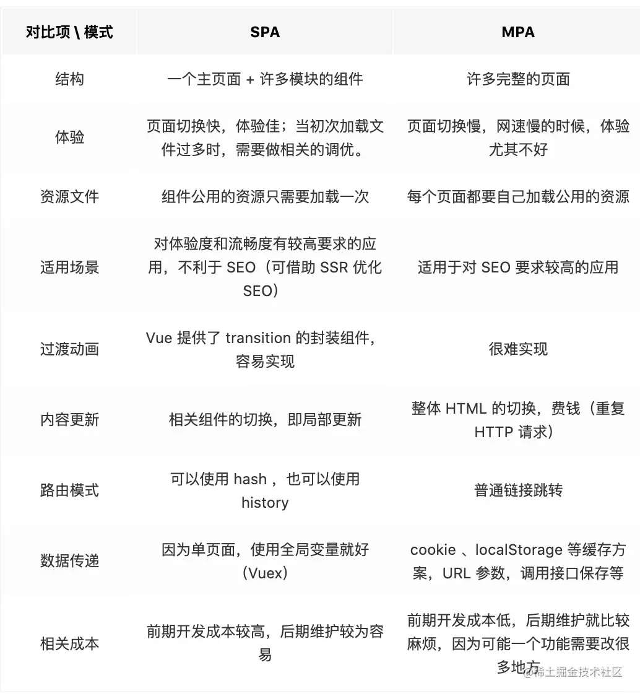

# vue2相关面试题

## 1. 对 React 和 Vue 的理解，它们的异同？

相似之处：

1. 都将注意力集中保持在核心库，而将其他功能如路由和全局状态管理交给相关的库；
2. 都有自己的构建工具，@vue/cli和create-react-app来最快创建最佳实践设置的项目模板；
3. 都使用了虚拟DOM来提高重绘性能；
4. 都有props的概念，允许组件间的数据传递；
5. 都鼓励组件化应用，提高复用性

不同之处

1. 数据流：Vue默认支持数据双向绑定，而React一直提倡单向数据流
2. 虚拟DOM：Vue宣称可以更快地计算出虚拟dom的差异，这是由于它在渲染过程中，会跟踪每一个组件的依赖关系，不需要重新渲染整个组件树；对于React而言，每当应用的状态被改变时，全部子组件都会重新渲染。也可以通过 PureComponent/shouldComponentUpdate这个生命周期方法来进行控制，但Vue将此视为默认的优化
3. 组件化：React与Vue最大的不同是模板的编写，Vue鼓励写近似常规HTML的模板。写起来很接近标准 HTML元素，只是多了一些属性，react推荐你所有的模板使用JSX书写
> 具体来讲：React中render函数是支持闭包特性的，所以import的组件在render中可以直接调用。但是在Vue中，由于模板中使用的数据都必须挂在 this 上进行一次中转，所以 import 一个组件完了之后，还需要在 components 中再声明下。
4. 监听数据变化的实现原理不同：Vue 通过 getter/setter 以及一些函数的劫持，能精确知道数据变化，不需要特别的优化就能达到很好的性能;React 默认是通过比较引用的方式进行的，如果不优化（PureComponent/shouldComponentUpdate）可能导致大量不必要的vDOM的重新渲染。这是因为 Vue 使用的是可变数据，而React更强调数据的不可变。
5. 高阶组件: react可以通过高阶组件（HOCK）来扩展，而Vue需要通过mixins来扩展

## 2. Vue的优点

1. 轻量级框架大小只有几十kb
2. 易于理解和学习；
3. 双向数据绑定，在数据操作方面更为简单；
4. 组件化
5. 视图，数据，结构分离：使数据的更改更为简单，不需要进行逻辑代码的修改，只需要操作数据就能完成相关操作；
6. 虚拟DOM：dom操作是非常耗费性能的，不再使用原生的 dom 操作节点，具体操作的还是 dom 不过是换了另一种方式；
7. 运行速度更快。

## 3. 什么是MVVM？

Model数据模型，View视图层，ViewModel视图数据层，MVVM模式不需要用户手动渲染DOM元素，而是直接将数据绑定到viewModel上面，会自动渲染数据到页面当中，试图变化会通知viewModel层更新数据，viewModel就是我们MVVM模式当中的桥梁，向下负责转换 Model 中的数据对象，向上为View做服务，解耦了 View 层和 Model 层

## 4. MVVM的优缺点?

优点1. 降低代码耦合，提⾼视图或者逻辑的重⽤性
优点2. 提⾼可测试性: ViewModel的存在可以帮助开发者更好地编写测试代码
优点3. ⾃动更新dom: 利⽤双向绑定,数据更新后视图⾃动更新,让开发者从繁琐的⼿动dom中解放
缺点1. Bug很难被调试: 因为使⽤双向绑定的模式，当你看到界⾯异常了，有可能是你View的代码有Bug，也可能是Model的代码有问题。数据绑定使得⼀个位置的Bug被快速传递到别的位置，要定位原始出问题的地⽅就变得不那么容易了。另外，数据绑定的声明是指令式地写在View的模版当中的，这些内容是没办法去打断点debug的
缺点2. ViewModel的构建和维护的成本都会⽐较⾼，性能方面也会有影响

## 5. vue是mvvm框架吗

不是，内部只是借鉴了mvvm的思想，vue的核心思想在于数据变化视图会更新，视图更新数据会被影响，而mvvm是不能跳过数据直接去更新视图，vue里面的$ref可以直接去更新dom不严格符合mvvm的思想，所以vue不是严格的mvvm框架

## 6. MVC和MVVM的区别？

+ 传统的MVC指的是，用户操作会请求服务器端的路由，路由会调用对应的控制器来处理，控制器会获取数据，将结果返回给前端，页面重新渲染

+  MVVM：MVVM模式不需要用户手动操作DOM元素，而是直接将数据绑定到viewModel上面，会自动渲染数据到页面当中，试图变化会通知viewModel层更新数据，viewModel就是我们MVVM模式当中的桥梁
  
## 7. 什么是库，什么是框架

+ 库是将代码集合成一个产品，我们调用库中的方法来实现自己的功能
+ 框架是为了解决一类问题而开发的产品，框架是我们在指定的位置编写好代码，框架帮我们调用

## 8. Vue 单页应用与多页应用的区别

+ SPA单页面应用（SinglePage Web Application），指只有一个主页面的应用，一开始只需要加载一次js、css等相关资源。所有内容都包含在主页面，对每一个功能模块组件化。单页应用跳转，就是切换相关组件，仅仅刷新局部资源。
+ MPA多页面应用 （MultiPage Application），指有多个独立页面的应用，每个页面必须重复加载js、css等相关资源。多页应用跳转，需要整页资源刷新。

