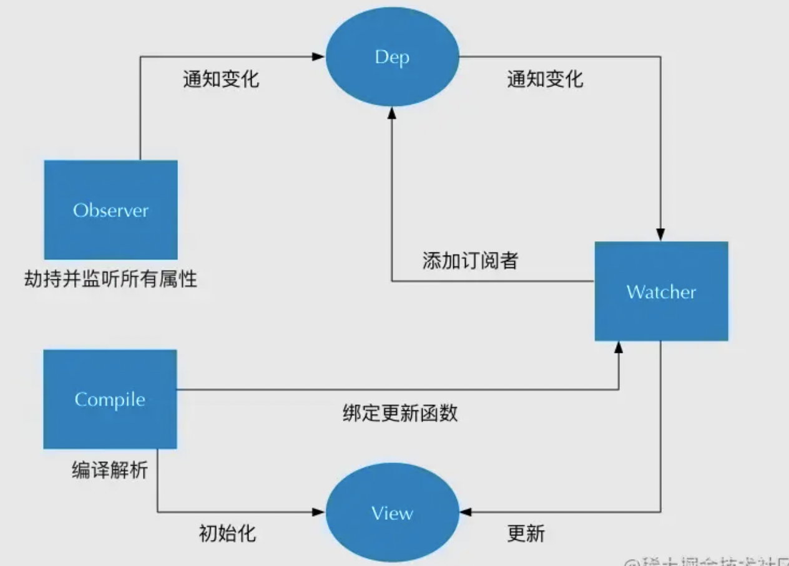

# 响应式相关的面试题

## 1. 请说一下响应式数据的理解？（Vue的响应式原理）

通过Object.defineProperty/proxy对data的getter/setter方法进行拦截，利用发布订阅者模式，在getter方法中进行订阅，在setter方法中通知，让所有订阅者完成响应。data的每一个属性都新建一个订阅中心作为发布者，对于watcher、computed、template/render作为订阅者，watcher会直接订阅观察监听的属性，对于computed和template/render，如果内部执行获取了data的某一个属性值，就会执行这个属性的getter方法，然后自动完成对该属性的订阅，当属性被修改后，就会执行这个属性的setter方法，从而完成这个属性的发布通知，通知所有的订阅者进行更新

主要分为以下几个步骤：

+ 需要observe的数据对象进行递归遍历，包括子属性对象的属性，都加上setter和getter这样的话，给这个对象的某个值赋值，就会触发setter，那么就能监听到了数据变化，多层对象是通过递归来实现劫持，数组则是通过重写数组方法来实现。
+ compile解析模板指令，将模板中的变量替换成数据，然后初始化渲染页面视图，并将每个指令对应的节点绑定更新函数，添加监听数据的订阅者，一旦数据有变动，收到通知，更新视图
+ Watcher订阅者是Observer和Compile之间通信的桥梁，主要做的事情是: ①在自身实例化时往属性订阅器(dep)里面添加自己 ②自身必须有一个update()方法 ③待属性变动dep.notice()通知时，能调用自身的update()方法，并触发Compile中绑定的回调。
+ MVVM作为数据绑定的入口，整合Observer、Compile和Watcher三者，通过Observer来监听自己的model数据变化，通过Compile来解析编译模板指令，最终利用Watcher搭起Observer和Compile之间的通信桥梁，达到数据变化 -> 视图更新；视图交互变化(input) -> 数据model变更的双向绑定效果。
  
## 2. vue中是如何检测数组变化的

vue2当中通过函数劫持的方式重写了数组的方法，利用原型链的特性，每次调用这些方法的时候实际上走的是我们自己重写的方法

vue3当中改用proxy，可以直接监听数组的变化

## 3. 使用 Object.defineProperty() 来进行数据劫持有什么缺点？

+ 对象默认只监控自带的属性，新增的属性响应式不生效 (层级过深，性能差)
+ 数组通过索引进行修改 或者 修改数组的长度，响应式不生效
  
为了解决以上问题，vm.$set -> 修改数组内部使用的是splice方法 和vm.$delete

## 4. Proxy 与 Object.defineProperty 优劣对比

Proxy 的优势如下:

+ Proxy 可以直接监听对象而非属性；可以直接监听数组的变化；
+ Proxy 有多达 13 种拦截方法,不限于 apply、ownKeys、deleteProperty、has 等等是 Object.defineProperty 不具备的；
+ Proxy 返回的是一个新对象,我们可以只操作新的对象达到目的,而 Object.defineProperty 只能遍历对象属性直接修改；
+ Proxy 如果对象内部要全部递归代理，则Proxy可以只在调用时递归，而Object.defineProperty需要在一开始就全部递归，Proxy性能优于Object.defineProperty

Object.defineProperty 的优势如下:

兼容性好，支持 IE9，而 Proxy 的存在浏览器兼容性问题,而且无法用 polyfill 磨平

## 5. 怎么理解vue的单向数据流？

父子组件之间的通信是单向的，是为了防止子组件意外的改变父组件的状态，从而导致应用的数据流难以理解，每次父级组件发生更新时，子组件中所有的props都会更新，子组件通过$emit派发一个自定义事件，父组件接收到后，由父组件修改数据

## 6. 什么是数据的丢失?

如果在初始化时没有定义数据，之后更新的数据是无法触发页面渲染更新的，这部分数据是丢失的数据

## 7. Vue 是如何实现数据双向绑定的？

数据双向绑定是数据变化更新视图，视图变化更新数据，View变化更新Data可以通过事件监听的方式来实现，主要通过以下 4 个步骤来实现数据双向绑定的：

1. 实现一个监听器 Observer：对数据对象进行遍历，包括子属性对象的属性，利用 Object.defineProperty() 对属性都加上 setter 和 getter。这样的话，给这个对象的某个值赋值，就会触发 setter，那么就能监听到了数据变化。
   
2. 实现一个解析器 Compile：解析 Vue 模板指令，将模板中的变量都替换成数据，然后初始化渲染页面视图，并将每个指令对应的节点绑定更新函数，添加监听数据的订阅者，一旦数据有变动，收到通知，调用更新函数进行数据更新。
   
3. 实现一个订阅者 Watcher：Watcher 订阅者是 Observer 和 Compile 之间通信的桥梁 ，主要的任务是订阅 Observer 中的属性值变化的消息，当收到属性值变化的消息时，触发解析器 Compile 中对应的更新函数。
   
4. 实现一个订阅器 Dep：订阅器采用 发布-订阅 设计模式，用来收集订阅者 Watcher，对监听器 Observer 和 订阅者 Watcher 进行统一管理。



## 8. vue的构造函数为什么没有使用class语法糖

vue构造函数的方法很多，如果使用class进行维护会篇幅很大，对于重写方法的行为也不是很友好，所以还是采用了构造函数的方式，在其原型上增加方法进行拓展

## 9. data中某一个属性的值发生改变后，视图会立即同步执行重新渲染吗？

不会立即同步执行重新渲染,Vue实现响应式并不是数据发生变化之后DOM立即变化，而是按一定的策略进行DOM的更新。在更新DOM时是异步的，监测到数据变化Vue 将开启一个队列进行缓冲，在同一事件循环中发生的所有数据变更。如果同一个watcher被多次触发，只会入到队列中一次，因为在缓冲时会去除重复数据，避免不必要的计算和DOM操作，在下一个的事件循环中会刷新队列并执行实际的工作。

## 10. Vue 中给 data 中的对象属性添加一个新的属性时会发生什么？如何解决？

不会发生试图更新，需要使用$set方法，$set()方法相当于手动的去把新增加的对象属性处理成一个响应式的属性，此时视图也会跟着改变了。

## 11. 在data上面定义了一个$name属性，可以通过Vue.$name拿到吗？

不可以，因为vue内部将所有$开头的属性都默认为是vue本身内置的属性

## 12. 直接给一个数组项赋值，Vue 能检测到变化吗？

不能，数组考虑性能原因没有用defineProperty对数组的每一项进行拦截，而是选择重写数组（push,shift,pop,splice,unshift,sort,reverse）方法进行重写。在Vue中修改数组的索引和长度是无法监控到的。需要通过上面的方法修改数组才会触发数组对应的watcher进行更新。数组中如果是对象数据类型也会进行递归劫持。可以通过Vue.$set()来进行处理, 其核心内部用的是splice方法，针对修改数组的长度使用**vm.items.splice(newLength)**解决

## 13. Vue中封装的数组方法有哪些，其如何实现页面更新

vue重写了数组的方法，push,shift,pop,splice,unshift,sort,reverse

简单来说就是，重写了数组中的那些原生方法，首先获取到这个数组的__ob__，也就是它的Observer对象，如果有新的值，就调用observeArray继续对新的值观察变化（也就是通过target.__proto__ == arrayMethods来改变了数组实例的原型），然后手动调用notify，通知渲染watcher，执行update。

## 14. Vue怎么用vm.$set()解决对象新增属性不能响应的问题 ？

通过调用重写的数组splice方法实现的


## 15. 给响应式数据添加标识为什么不可以直接使用value.__ob__ = this?

因为value是一个被观测得响应式的值，如果这样赋值就会触发Object.defineProperty方法的set方法，此时无限递归会陷入死循环

通过`Object.defineProperty`方法添加`__ob__`属性，这个属性是不能被枚举不能被循环出来的，所以不会有影响

## 16. 定义响应式数据的时候在defineReactive的set方法内部，不直接value[key]赋值？

会陷入死循环

## 17. 手动实现一个proxy的响应式

```js
let state = { count: 0 };
// app.innerHTML = state.count;

// 1.将数据变成响应式数据
let active;
function defineReactive(obj) {
    for (let key in obj) {
        let value = obj[key];
        let dep = [];
        Object.defineProperty(obj, key, {
            get() {
                if (active) {
                    dep.push(active);
                }
                return value;
            },
            set(newValue) {
                value = newValue;
                dep.forEach(fn => fn());

            }
        });
    }
}
defineReactive(state);
const watcher = (fn) => {
    active = fn;
    fn();
    active = null;
}
watcher(() => {
    app.innerHTML = state.count;
});
watcher(() => {
    console.log(state.count)
});
```

## 18. Vue是如何重写数组方法的？

```js
let state = [1,2,3];
let originArray = Array.prototype;
let arrayMethods = Object.create(originArray);

function defineReactive(obj) {
    arrayMethods.push = function (...args) {
        originArray.push.call(this,...args);
        render();
    }
    obj.__proto__ = arrayMethods;
}
defineReactive(state);

function render(){
    app.innerHTML = state;
}
render();
state.push(4)
```