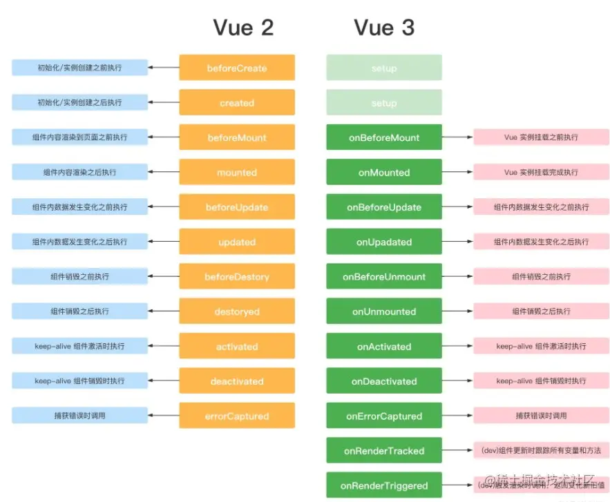

# vue3相关面试题

## 一、对于即将到来的 vue3.0 特性你有什么了解的吗？

Vue 3.0 的目标是让 Vue 核心变得更小、更快，因此 Vue 3.0 增加以下这些新特性：

1. 监测机制的改变

3.0 将带来基于代理 Proxy 的 observer 实现，提供全语言覆盖的反应性跟踪。这消除了 Vue 2 当中基于 Object.defineProperty 的实现所存在的很多限制：

+ 只能监测属性，不能监测对象
  
+ 检测属性的添加和删除；
  
+ 检测数组索引和长度的变更；
  
+ 支持 Map、Set、WeakMap 和 WeakSet。

新的 observer 还提供了以下特性：

+ 用于创建 observable 的公开 API。这为中小规模场景提供了简单轻量级的跨组件状态管理解决方案。
  
+ 默认采用惰性观察。在 2.x 中，不管反应式数据有多大，都会在启动时被观察到。如果你的数据集很大，这可能会在应用启动时带来明显的开销。在 3.x 中，只观察用于渲染应用程序最初可见部分的数据。
  
+ 更精确的变更通知。在 2.x 中，通过 Vue.set 强制添加新属性将导致依赖于该对象的 watcher 收到变更通知。在 3.x 中，只有依赖于特定属性的 watcher 才会收到通知。
  
+ 不可变的 observable：我们可以创建值的“不可变”版本（即使是嵌套属性），除非系统在内部暂时将其“解禁”。这个机制可用于冻结 prop 传递或 Vuex 状态树以外的变化。
  
+ 更好的调试功能：我们可以使用新的 renderTracked 和 renderTriggered 钩子精确地跟踪组件在什么时候以及为什么重新渲染。

1. 模板
   
模板方面没有大的变更，只改了作用域插槽，2.x 的机制导致作用域插槽变了，父组件会重新渲染，而 3.0 把作用域插槽改成了函数的方式，这样只会影响子组件的重新渲染，提升了渲染的性能。

同时，对于 render 函数的方面，vue3.0 也会进行一系列更改来方便习惯直接使用 api 来生成 vdom 。

3. 对象式的组件声明方式
   
vue2.x 中的组件是通过声明的方式传入一系列 option，和 TypeScript 的结合需要通过一些装饰器的方式来做，虽然能实现功能，但是比较麻烦。3.0 修改了组件的声明方式，改成了类式的写法，这样使得和 TypeScript 的结合变得很容易。

此外，vue 的源码也改用了 TypeScript 来写。其实当代码的功能复杂之后，必须有一个静态类型系统来做一些辅助管理。现在 vue3.0 也全面改用 TypeScript 来重写了，更是使得对外暴露的 api 更容易结合 TypeScript。静态类型系统对于复杂代码的维护确实很有必要。

4. 其它方面的更改
   
vue3.0 的改变是全面的，上面只涉及到主要的 3 个方面，还有一些其他的更改：

+ 支持自定义渲染器，从而使得 weex 可以通过自定义渲染器的方式来扩展，而不是直接 fork 源码来改的方式。
  
+ 支持 Fragment（多个根节点）和 Protal（在 dom 其他部分渲染组建内容）组件，针对一些特殊的场景做了处理。
  
+ 基于 treeshaking 优化，提供了更多的内置功能。

## 2. defineProperty和proxy的区别

Vue在实例初始化时遍历data中的所有属性，并使用 Object.defineProperty 把这些属性全部转为 getter/setter。并 劫持各个属性 getter 和 setter，在数据变化时发布消息给订阅者，触发相应的监听回调，而这之间存在几个问题

+ 初始化时需要遍历对象所有 key，如果对象层次较深，性能不好
+ 通知更新过程需要维护大量 dep 实例和 watcher 实例，额外占用内存较多
+ Object.defineProperty 无法监听到数组元素的变化，只能通过劫持重写数组方法
+ 动态新增，删除对象属性无法拦截，只能用特定 set/delete API 代替
+ 不支持 Map、Set 等数据结构

Vue3 使用 Proxy 来监控数据的变化。Proxy 是 ES6 中提供的功能，其作用为：用于定义基本操作的自定义行为（如属性查找，赋值，枚举，函数调用等）。相对于Object.defineProperty()，其有以下特点：

+ Proxy 直接代理整个对象而非对象属性，这样只需做一层代理就可以监听同级结构下的所有属性变化，包括新增属性和删除属性。
+ 它的处理方式是在 getter 中去递归响应式，这样的好处是真正访问到的内部属性才会变成响应式，简单的可以说是按需实现响应式，减少性能消耗。
+ Proxy 可以监听数组的变化。

## 3. Vue3 Diff算法和 Vue2 的区别

我们知道在数据变更触发页面重新渲染，会生成虚拟 DOM 并进行 patch 过程，这一过程在 Vue3 中的优化有如下
+ 编译阶段的优化：
  - 事件缓存：将事件缓存(如: @click)，可以理解为变成静态的了
  - 静态提升：第一次创建静态节点时保存，后续直接复用
  - 添加静态标记：给节点添加静态标记，以优化 Diff 过程
  由于编译阶段的优化，除了能更快的生成虚拟 DOM 以外，还使得 Diff 时可以跳过"永远不会变化的节点"，
+ Diff 优化如下
  - Vue2 是全量 Diff，Vue3 是静态标记 + 非全量 Diff
  - 使用最长递增子序列优化了对比流程
目前公布的数据就是 Vue3 update 性能提升了 1.3~2 倍

## 4. composition API 与 options API的区别

vue2 采用的就是optionsAPI，易于学习和使用每个代码有着明确的位置但是相似的逻辑, 不容易复用, 在大项目中尤为明显，虽然可以通过mixins 提取相同的逻辑, 但是也并不是特别好维护

vue3 新增的就是compositionAPI，基于逻辑功能组织代码的, 一个功能api相关放到一起，即使项目大了, 功能多了, 也能快速定位功能相关的 api，提升了代码可读性 和可维护性

## 5. Composition API与React Hook很像，区别是什么？

React Hook是根据useState调用的顺序来确定下一次重渲染时的state是来源于哪个useState，所以出现了一些限制

+ 不能在循环、条件、嵌套函数中调用Hook
+ 必须确保总是在你的React函数的顶层调用Hook
+ useEffect、useMemo等函数必须手动确定依赖关系

而Composition API是基于Vue的响应式系统实现的，区别是：

+ 声明在setup函数内，一次组件实例化只调用一次setup，而React Hook每次重渲染都需要调用Hook，使得React的GC比Vue更有压力，性能也相对于Vue来说也较慢
+ Compositon API的调用不需要顾虑调用顺序，也可以在循环、条件、嵌套函数中使用
+ 响应式系统自动实现了依赖收集，进而组件的部分的性能优化由Vue内部自己完成，而React Hook需要手动传入依赖，而且必须必须保证依赖的顺序，让useEffect、useMemo等函数正确的捕获依赖变量，否则会由于依赖不正确使得组件性能下降。

虽然Compositon API看起来比React Hook好用，但是其设计思想也是借鉴React Hook的。

## 6. setup函数

setup()函数为使用vue3的 Composition API 新特性提供了统一的入口,setup 函数会在 beforeCreate 、created 之前执行, vue3也是取消了这两个钩子，统一用setup代替, setup相当于一个生命周期函数，vue中过去的data，methods，watch等全部都用对应的新增api写在setup函数中，setup接收两个参数 props 和 context。它里面不能使用 this，而是通过 context 对象来代替当前执行上下文绑定的对象，context 对象有四个属性：attrs、slots、emit、expose，里面通过 ref 和 reactive 代替以前的 data 语法，return 出去的内容，可以在模板直接使用，包括变量和方法

## 7. setup语法糖 （script setup语法）

`<script setup>`在单文件组件 (SFC) 中使用组合式 API 的编译时语法糖, 顶层的绑定会自动暴露给模板，所以定义的变量，函数和import导入的内容都可以直接在模板中直接使用

3.0~3.2版本变成了通过 import 引入的 API：defineProps、defineEmit、useContext(在3.2版本已废弃)，useContext 的属性 { emit, attrs, slots, expose }

3.2+版本不需要引入，而直接调用：defineProps、defineEmits、defineExpose、useSlots、useAttrs

## 8. reactive、shallowReactive 函数

reactive函数接收一个普通对象，返回一个响应式的数据对象, 相当于Vue2中的Vue.observable API，响应式转换是深层次影响所有嵌套属性，基于proxy来实现

shallowReactive：创建一个响应式代理，它跟踪其自身属性的响应性shallowReactive生成非递归响应数据，只监听第一层数据的变化，但不执行嵌套对象的深层响应式转换 (暴露原始值)

## 9. ref和reactive的区别

ref：根据给定的值创建一个响应式数据，返回一个对象，只包含一个value属性，在setup函数内部访问需要加上.value, 用来创建独立的原始值

reactive：将解包所有深层的refs，同时维持ref的响应性。当将ref分配给reactive property 时，ref将被自动解包

reactive/ref的响应式功能是赋值给对象的, 如果给对象解构或者展开, 会让数据丢失响应式的能力

## 10. ref、 shallowRef 、isRef、toRefs 函数

+ shallowRef: 浅层ref作用形式，用于大型数据结构的性能优化
+ isRef: 判断这个值是否由ref创建的
+ toRefs: 可以保证响应式对象当中每一个属性都是响应式的

## 11. readonly、isReadonly、shallowReadonly函数

+ readonly: 传入ref/reactive对象，返回一个原始对象的只读代理，对象递归只读
+ isReadonly: 检查对象是否是由 readonly 创建的只读对象
+ shallowReadonly: 只处理对象最外层属性的响应式的只读

## 12. readonly和const有什么区别？

+ const是赋值保护，使用const定义的变量，该变量不能重新赋值。但如果const赋值的是对象，那么对象里面的东西是可以改的。原因是const定义的变量不能改说的是，对象对应的那个地址不能改变
+ 而readonly是属性保护，不能给属性重新赋值

## 13. computed、watch函数

computed: 返回一个ref对象，内部传递方法或者一个具有get、set方法的对象
watch：监听特定的数据源，支持多个数据源同时监听、或者监听某一个对象的某一个属性；在回调函数当中执行副作用，懒执行，可以设置immediate

## 14. watch 和 watchEffect 的区别

watch作用是对传入的某个或多个值的变化进行监听；触发时会返回新值和老值；默认只有变化了才会执行

watchEffect传入一个函数会立即执行；不需要传入监听内容会自动收集函数内部的数据源作为依赖，在依赖发生变化的时候又会重新执行该函数，如果没有依赖就不会执行；不会返回变化前后的新老值

## 15. Vue3的生命周期

基本上就是在 Vue2 生命周期钩子函数名基础上加了 on；beforeDestory 和 destoryed 更名为 onBeforeUnmount 和 onUnmounted；然后用setup代替了两个钩子函数 beforeCreate 和 created；新增了两个开发环境用于调试的钩子



## 16. setup语法下怎么设置name属性

使用插件vite-plugin-vue-setup-extend；配置vite.config.js的plugins;在标签中使用`<script setup name="MyCom">`

## 17. Vue3怎么让全局组件有提示

定义全局的 global.d.ts 

```js
declare module 'vue' {
  export interface GlobalComponents {
    XtxSkeleton: typeof XtxSkeleton
  }
}
```
## 18. Vue3怎么注册全局自定义指令

app.directive('指令名‘，配置对象)


## 19. Vue3全局自定义指令的钩子函数

## 20. Vue3的v-model语法

