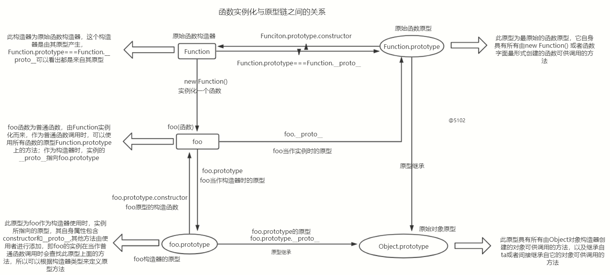

# 原型与原型链

## 一、什么是javaScript的原型？

在规范里，`prototype`被定义为给其它对象提供共享属性的对象，`prototype`描述的是两个对象之间的某种关系（其中一个，为另一个提供属性访问权限）。规范中明确描述了所有对象，都有一个隐式引用，它被称之为这个对象的 prototype 原型。JS 原型其实是一个隐式的单向链表

### 1. ECMAScript 规范说 prototype 应当是一个隐式引用，目前有两种访问规则

1. 通过 Object.getPrototypeOf(obj) 间接访问指定对象的 prototype 对象，通过 Object.setPrototypeOf(obj, anotherObj) 间接设置指定对象的 prototype 对象。
2. 部分浏览器提前开了 __proto__ 的口子，使得可以通过 obj.__proto__ 直接访问原型，通过 obj.__proto__ = anotherObj 直接设置原型。ECMAScript 2015 规范只好向事实低头，将 __proto__ 属性纳入了规范的一部分,__proto__ 属性既不能被 for in 遍历出来，也不能被 Object.keys(obj) 查找出来,访问对象的 obj.__proto__ 属性，默认走的是 Object.prototype 对象上 __proto__ 属性的 get/set 方法。

### 2. 手动实现一个__proto__属性(对象原型)

> 对象的属性并非ECMAScript的标准，而是由于早起无法获得对象原型即对象内部属性```[[prototype]]```, 所以各大浏览器厂家使用```Object.prototype```
> 通过访问描述符实现```__proto__```的getter和setter来达到访问调用对象的```[[prototype]]```属性
> ```[[prototype]]```属性属于对象的内部属性无法直接访问，此属性指向对象原型

```__proto__```的大致实现

```js
Object.defineProperty(Object.prototype, '__proto__', {
    set: function (o) {
        Object.setPropertyOf(this, o) // 设置引用对象[[Prototype]]属性关联的原型为o
        return o
    },
    get: function () {
        return Object.getPropertyOf(this) // 获取引用对象的[[Prototype]]
    }
})
```

## 二、什么是原型链？

javascript的原型prototype只是恰好作为另一个对象的隐式引用的普通对象。那么，它也是对象，也符合一个对象的基本特征。也就是说，prototype 对象也有自己的隐式引用，有自己的 prototype 对象。如此，构成了对象的原型的原型的原型的链条，直到某个对象的隐式引用为 null，整个链条终止。这样的链条就叫做原型链。

**原型链的实现方法：**

```js
const lookupProtptype  = (obj, objName) => {
    let current = obj
    if(current === null) {
        throw new Error('error')
    }

    while(current) {
        if(current.hasOwnProperty(objName)) {
            return current[objName]
        }
        current = Object.getPrototypeOf(current)
    }
    return undefined
}

console.log('queal', lookupProtptype({}, 'toString') === Object.prototype.toString) // true
```

## 三、原型的继承方式

原型具有两种继承方式：（这两种方式的主要区别在于是否由开发者亲自操作）

+ 显示继承
+ 隐式继承

### 1. 显示继承

1. 通过调用 **Object.setPrototypeOf** 方法，Object.setPrototypeOf(a, b): 将b设置成a的原型对象
2. 通过 Object.create 方法，直接继承另一个对象

**Object.setPropertyOf 和 Object.create 的差别在于：**

1. Object.setPropertyOf，给我两个对象，我把其中一个设置为另一个的原型。

2. Object.create，给我一个对象，它将作为我创建的新对象的原型。

当我们已经拥有两个对象时，要构建原型关联，可以通过 Object.setPrototypeOf 来处理。

当我们只有一个对象，想以它为原型，创建新对象，则通过 Object.create 来处理。

### 2. 隐式继承

隐式原型继承，是将 初始化, 原型挂载, 实例化 等多个步骤耦合到一起，可以让用户更少的操作来实现无感知的创建对象

1. 对象字面量和数组字面量这样的语法糖的出现，完美的实现了隐式继承
2. 函数在创建的过程中默认具有prototype属性，用户只需要指明构造函数初始化 + new操作符实例化即可，除非新增方法，否则不需要操作prototype

#### 当我们使用对象字面量创建一个新对象时，它有两层隐式行为。

1. 隐式的通过 new Object() 去创建对象

2. 隐式的进行原型继承即具备constructor属性指向构造函数，并且具备__proto__属性指向Object.prototype

当我们创建一个普通函数的时候

1. 创建一个contructor函数迎来初始化
2. 默认让每一个函数都具有一个prototype属性，默认指向Object.prototype
3. 并且通过new操作符创建一个新的对象

```js
function User(firstName, lastName){
    this.firstName = firstName
    this.lastName = lastName
}

User.prototype = Object.create(Object.prototype)

const user = new User()
```
#### 普通函数的隐式继承

每一个函数在创建的过程中默认就都具备一个prototype属性，这个属性是一个对象，包含 constructor 一个字段，指向构造函数。这样用户通常只需要编写 constructor 函数，描述如何初始化对象的属性即可。除非他们需要新增方法，否则都不必操作 constructor 的 prototype 对象。

```js
function Test(){}

Test.prototype === Test
```

constructor 是一个函数，而所有函数都是 new Function 创建出来的，函数字面量可以看作是它的语法糖。也就是说，函数也是对象，也有自己的隐式引用（原型）。但函数的 prototype 属性，却不是该函数对象的原型。而是基于隐式原型继承规则，作为原型，挂载到 new F() 创建出来的新对象内部。

所以 `Test()` 只具备prototype属性，该属性是一个对象即 `{ constructor: Test }`

而 `new` 操作符实例化的对象是具有 `__proto__` 属性的， 指向 `test.prototype`
 
## 四、详细解释函数的prototype属性

> 所有函数都有的```prototype```属性，js中函数也属于对象的一个子类型，所以函数也具有```__proto__```与普通对象类似都指向其原型
> 而这里的```prototype```属性是函数特有的
> 但函数使用new操作进行修饰时，我们可以理解为该函数被当做构造函数使用也就是构造器，当函数被当作构造函数时，其```prototype```就起了作用
> 使得由```new操作符修改的构造函数创建```的出来的```对象```的```__proto__```属性指向```构造函数```的```prototype```

```js
function Parent () {
    console.log('aaaa')
}
const child = new Parent()

console.log(child.__proto__ === Parent.prototype)
console.log(Parent.prototype.__proto__ === Object.prototype)

```

为了便于讲解，这里将函数的```prototype```属性称呼为```构造器原型```以便接下来的讲解。

+ 这里要区分函数的```__proto__```属性是作为对象时关联的原型即对象原型

+ 函数的```prototype```作为构造函数调用时关联的原型即构造器原型
  
这里要先弄清楚其中的区别，以便接下来的讲解

## 五、原型链之间的关系 & 各类方法与属性的统称

> 构造函数当中定义的方法叫做```静态方法```，构造函数当中定义的属性叫做```静态属性```
> 在原型当中定义的方法叫做```原型方法```，在原型当中定义的属性叫做```原型属性```
> 实例中的```属性```以及```方法```，我们也就称呼为```实例属性/方法```
> 当然方法也属于属性，只是我们通常把定义在对象中的函数称为方法

1. 原型

+ 只有对象类型的才有原型的概念
+ ```普通对象```（即使用对象字面量或者Object构造器创建的对象）的```原型```为```__proto__```，这个属性其实就是一个构造器属性，并不是真实存在的属性，可以使用```Reflect.getPropertyOf(obj)```或者```Object.getPropertyOf(obj)```获得对象的原型。其关系主要是```Reflect.getPropertyOf({}) === Object.getPropertyOf({}) === {}.__proto__```
+ ```普通函数```有两个属性，一个是```__proto__```属性与普通对象类似，还有一个是函数的独有属性```prototype```，因为函数有双重身份，既是```实例```也可以是```构造器```
+ 不是所有的```对象```都会有```原型```，比如对象原型```Object.prototype```的原型```Object.prototype.__proto__```就指向```null```，字典对象的原型也为```null```(把对象的__proto__设置为null，或者使用Object.create(null)创建一个```没有原型```的```字典对象```，但是这个对象还是属于```对象类型```)，所以```原始对象原型(Object.prototype)```就是最原始的原型，其他对象类型都要继承自它。
+ 箭头函数虽然属于函数，由Function产生， 但是没有```prototype```属性```没有构造器特性```，所以也就没有所谓的```constructor```，就不能作为```构造器```使用

2. 原型链

这里会详细介绍原型、原型链、实例、构造器的关系 先看最原始的关系


```js
// Object
Object.__proto__ === Function.prototype
Object.__proto__.constructor === Function
Function.prototype.__proto__ === Object.prototype
Object.prototype.__proto__ === null
Object.prototype.constructor === Objct

const obj = new Object()

obj.__proto__ === Object.prototype
obj.__proto__.constructor === Object

console.log(Function.prototype.__proto__.constructor.__proto__.constructor === Function)
```

+ 所有函数都是由Function函数构造器实例化而来
+ 所有实例的原型都指向构造它的构造器的prototype
+ 每个构造器自身特有的方法就是静态方法，原型上的方法可供所有继承它或间接继承它的实例使用
+ 构造器也是函数，也是被Function实例化出来的，所以构造器的__proto__就是Function，但是构造器的prototype属性指向的原型，是此构造器实例化出来的实例所指向的原型；简单说构造器的prototype就是作为它的实例的原型



```js

function A () {}
const b = new A ()
// 此时函数A作为普通函数
A.__proto__ === Function.prototype
A.__proto__.constructor === Function
A.prototype.__proto__ === Object.prototype
A.prototype.__proto__.constructor === Object

// 此时函数A作为构造函数实例化对象
b.__proto__ === A.prototype
b.constructor === A

// 此时C是通过原始函数的构造函数函数构造出来的实例
const C = new Function () {}

C.__proto__ === Function.prototype
C.__proto__.constructor === Function

```

+ 在js中```函数```有多重身份，函数可以作为```类```就是```构造器```使用，定义静态方法，作为```普通函数调用```，
+ 只有由```原始函数构造器(Function)```实例化的函数才拥有直接使用```函数原型```(Function.prototype)上面的内置方法，```创建函数只能通过原始函数构造器生成```，
+ ```普通函数```作为```构造器```使用```(new)```时相当于```类(class)```使用，类的```prototype```就是实例的原型，我们可以给```原型```添加属性，给```类```添加属性时就相当于给```构造器```添加静态属性
+ ```普通函数在创建实例```的时候，会生成一个```实例```的```原型```，此```原型```指向```Object.prototype```即```原始对象原型```，也就是```继承对象原型```，这么一来```实例也继承了对象的原型，则实例也属于对象类型```


## 六、面试题：

1. 谈谈你对 JS 原型和原型链的理解？

JS 原型是指为其它对象提供共享属性访问的对象。在创建对象时，每个对象都包含一个隐式引用指向它的原型对象或者 null。

原型也是对象，因此它也有自己的原型。这样构成一个原型链。

2. 原型链有什么作用？

在访问一个对象的属性时，实际上是在查询原型链。这个对象是原型链的第一个元素，先检查它是否包含属性名，如果包含则返回属性值，否则检查原型链上的第二个元素，以此类推。

3. 那如何实现原型继承呢？
   
有两种方式。一种是通过 Object.create 或者 Object.setPrototypeOf 显式继承另一个对象，将它设置为原型。

另一种是通过 constructor 构造函数，在使用 new 关键字实例化时，会自动继承 constructor 的 prototype 对象，作为实例的原型。

在 ES2015 中提供了 class 的风格，背后跟 constructor 工作方式一样，写起来更内聚一些。

4. ConstructorB 如何继承 ConstructorA ？

JS 里的继承，是对象跟对象之间的继承。constructor 的主要用途是初始化对象的属性。

因此，两个 Constructor 之间的继承，需要分开两个步骤。

第一步是，编写新的 constructor，将两个 constructor 通过 call/apply 的方式，合并它们的属性初始化。按照超类优先的顺序进行。

第二步是，取出超类和子类的原型对象，通过 Object.create/Object.setPrototypeOf 显式原型继承的方式，设置子类的原型为超类原型。

整个过程手动编写起来比较繁琐，因此建议通过 ES2015 提供的 class 和 extends 关键字去完成继承，它们内置了上述两个步骤。

5. 看起来你挺了解原型，你能说一个原型里比较少人知道的特性吗？
   
在 ES3 时代，只有访问属性的 get 操作能触发对原型链的查找。在 ES5 时代，新增了 accessor property 访问器属性的概念。它可以定义属性的 getter/setter 操作。

具有访问器属性 setter 操作的对象，作为另一个对象的原型的时候，设置属性的 set 操作，也能触发对原型链的查找。

普通对象的 __proto__ 属性，其实就是在原型链查找出来的，它定义在 Object.prototype 对象上。

6. 为什么 typeof 判断 null 是 Object 类型？

因为Object.prototype指向null，而javaScript的原型描述的是两个对象之间的某种关系（其中一个，为另一个提供属性访问权限），所以这是对象和对象之间的关系，所以typeof 判断 null 是 Object 类型

7. Function 和 Object 是什么关系？

JavaScript 中的 Object 和 Function 就是典型的函数对象。

8. new 关键字具体做了什么？手写实现。


   
   
9.  
10. prototype 和__proto__是什么关系？什么情况下相等？
11. ES5 实现继承有几种方式，优缺点是啥
12. ES6 如何实现一个类
13. ES6 extends 关键字实现原理是什么
14. prototype存在的缺点

+ 1. 隐式属性访问让程序更不可靠，也容易带来困惑
+ 2. 不利于体积优化
+ 3. 不利于代码复用


