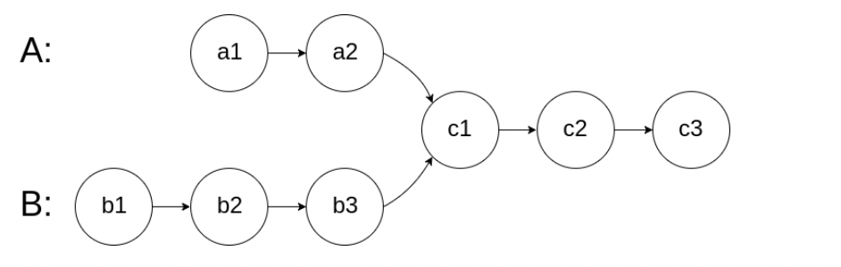
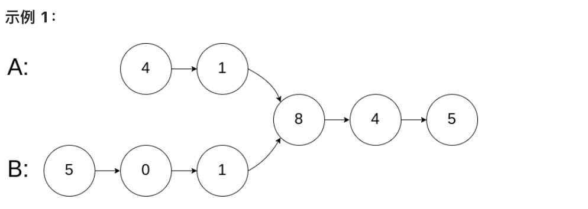

# 链表相交

给你两个单链表的头节点 headA 和 headB ，请你找出并返回两个单链表相交的起始节点。如果两个链表没有交点，返回 null 。

图示两个链表在节点 c1 开始相交：



题目数据 保证 整个链式结构中不存在环。

注意，函数返回结果后，链表必须 保持其原始结构 。



```sh
输入：intersectVal = 8, listA = [4,1,8,4,5], listB = [5,0,1,8,4,5], skipA = 2, skipB = 3

输出：Intersected at '8'

解释：相交节点的值为 8 （注意，如果两个链表相交则不能为 0）。

从各自的表头开始算起，链表 A 为 [4,1,8,4,5]，链表 B 为 [5,0,1,8,4,5]。

在 A 中，相交节点前有 2 个节点；在 B 中，相交节点前有 3 个节点。
```

## 解题思路1: 使用哈希表存储第一个链表的值，如果第二个链表在哈希表中存在，那么这个节点就是相交节点，时间复杂度 O(M + N),空间复杂度 O(n)

```js
/**
 * Definition for singly-linked list.
 * function ListNode(val) {
 *     this.val = val;
 *     this.next = null;
 * }
 */

/**
 * @param {ListNode} headA
 * @param {ListNode} headB
 * @return {ListNode}
 */
var getIntersectionNode = function(headA, headB) {
    let set = new Set()
    let tmp = headA
    while(tmp !== null) {
        set.add(tmp)
        tmp = tmp.next
    }
    tmp = headB
    while(tmp !== null) {
        if(set.has(tmp)) return tmp
        tmp = tmp.next
    }
    return null
};
```

## 解题思路2:双指针，时间复杂度O(M + N), 空间复杂度O(1)

使用双指针的方法，可以将空间复杂度降至 O(1)O(1)。

只有当链表 headA 和 headB 都不为空时，两个链表才可能相交。因此首先判断链表 headA 和 headB 是否为空，如果其中至少有一个链表为空，则两个链表一定不相交，返回 null。

当链表 headA 和 headB 都不为空时，创建两个指针 pA 和 pB，初始时分别指向两个链表的头节点 headA 和 headB，然后将两个指针依次遍历两个链表的每个节点。具体做法如下：

每步操作需要同时更新指针 pA 和 pB。

如果指针 pA 不为空，则将指针 pA 移到下一个节点；如果指针 pB 不为空，则将指针 pB 移到下一个节点。

如果指针 pA 为空，则将指针 pA 移到链表 headB 的头节点；如果指针 pB 为空，则将指针 pB 移到链表 headA 的头节点。

当指针 pA 和 pB 指向同一个节点或者都为空时，返回它们指向的节点或者 null。

```js
/**
 * Definition for singly-linked list.
 * function ListNode(val) {
 *     this.val = val;
 *     this.next = null;
 * }
 */

/**
 * @param {ListNode} headA
 * @param {ListNode} headB
 * @return {ListNode}
 */
var getIntersectionNode = function(headA, headB) {
    if(headA === null || headB === null ) return null
    let p1 = headA
    let p2 = headB
    while(p1 !== p2) {
        p1 = p1 === null ? headB : p1.next
        p2 = p2 === null ? headA : p2.next
    }
    return p1
};
```