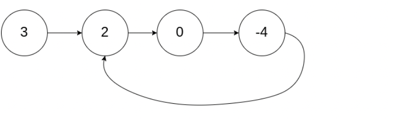

# 环路检测

给定一个链表，如果它是有环链表，实现一个算法返回环路的开头节点。若环不存在，请返回 null。

如果链表中有某个节点，可以通过连续跟踪 next 指针再次到达，则链表中存在环。 为了表示给定链表中的环，我们使用整数 pos 来表示链表尾连接到链表中的位置（索引从 0 开始）。 如果 pos 是 -1，则在该链表中没有环。注意：pos 不作为参数进行传递，仅仅是为了标识链表的实际情况。



```bash
输入：head = [3,2,0,-4], pos = 1
输出：tail connects to node index 1
解释：链表中有一个环，其尾部连接到第二个节点
```

## 解题思路1: 哈希表

```js
var detectCycle = function(head) {
    const visited = new Set();
    while (head !== null) {
        if (visited.has(head)) {
            return head;
        }
        visited.add(head);
        head = head.next;
    }
    return null;
};
```

## 快慢指针

快慢指针，先找相交的地方，再找环路的 入口。

快指针走两步，慢指针走1步，如果链表存在环，快慢指针总会相交

然后快指针从头开始走，找位置，慢指针沿着环走，也一定会相交，相交位置就是环的起始位置

```js
/**
 * Definition for singly-linked list.
 * function ListNode(val) {
 *     this.val = val;
 *     this.next = null;
 * }
 */

/**
 * @param {ListNode} head
 * @return {ListNode}
 */
var detectCycle = function(head) {
  let fast = head
  let flow = head
  while(fast && fast.next){
    fast = fast.next.next
    flow = flow.next
    if(fast == flow){
      break
    }
  }
  if(!fast || !fast.next) return null
  fast = head
  while(fast != flow){
    fast = fast.next
    flow = flow.next
  }
  return fast
};
```