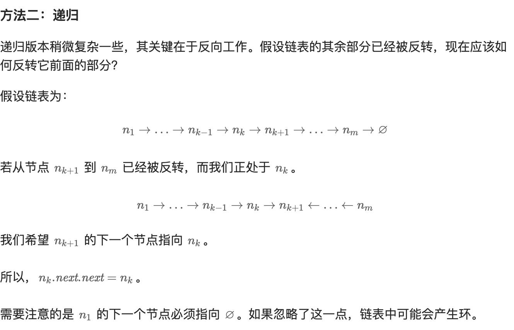

# 反转链表

给你单链表的头节点 head ，请你反转链表，并返回反转后的链表。

```js
[1,2,3,4,5] -> [5,4,3,2,1]
```

## 解题思路

### 1. 迭代法

```js
var reverseList = function(head) {
    let pre = null
    let cur = head
    while(cur) {
        const next = cur.next
        cur.next = pre
        pre = cur
        cur = next
    }
    return pre
}
```

复杂度分析

+ 时间复杂度：O(n)，其中 n 是链表的长度。需要遍历链表一次。

+ 空间复杂度：O(1)

### 2. 递归法


```js
var reverseList = function(head) {
    if (head == null || head.next == null) {
        return head;
    }

   let newHead = reverseList(head.next)
   head.next.next = head
   head.next = null
   return newHead
};
```