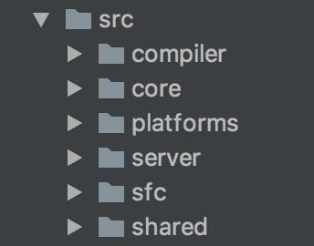
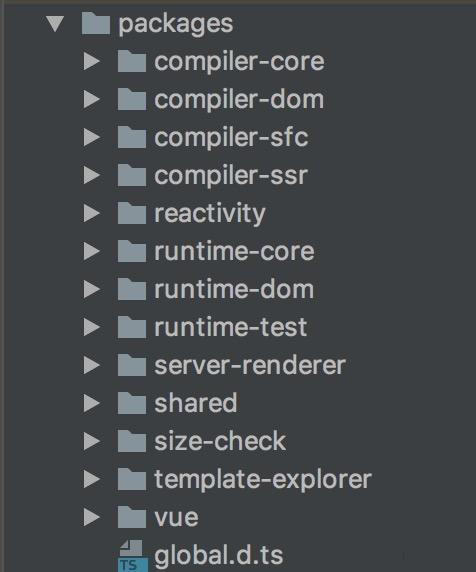
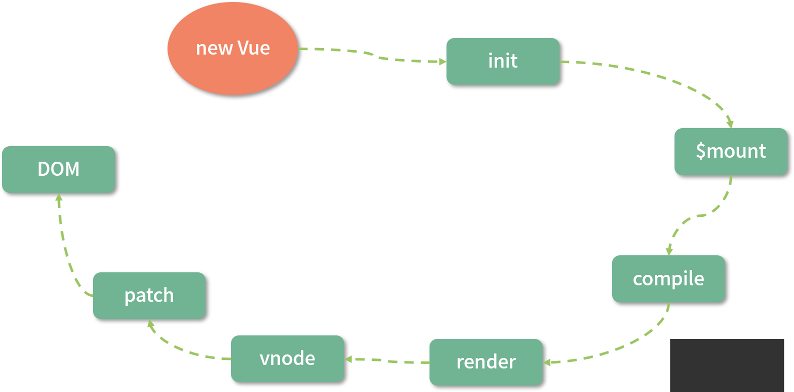
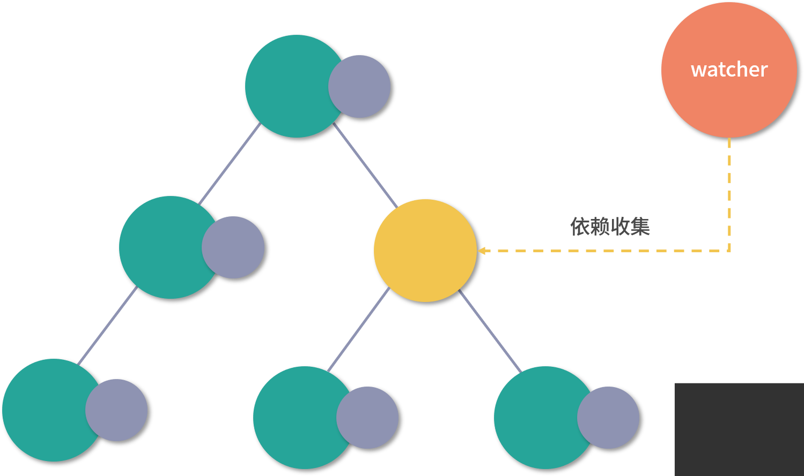

# 导读 | 一文看懂 Vue.js 3.0 的优化

##  Vue.js 框架演进的过程

vue1.x到2.x的过程主要增加了虚拟dom的概念，为后续的服务器端渲染以及跨终端框架weex提供了基础

vue2.x到目前为止，生态环境已经十分的强大，对于开发者而言使用感受较好，但是对于迭代开发者而言，vue2.x的代码维护，数据量大后带来的渲染和更新的性能问题，以及一些一直想舍弃但是为了兼容一直不能舍弃的鸡肋api等问题，vue的作者想给开发人员带来更好的编程体验，在接下来的vue3.x主要从**源码**、**性能**和**语法 API**三个大的方面优化框架

## vue3.x优化

### 一、源码优化

源码的优化主要体现在使用`monorepo`和`typescript`来进行管理框架源码，主要目的在于让代码更加易于开发和维护

**1. 更好的代码管理方式：monorepo**

vue2.x的目录结构是将主要的代码都托管在src文件夹下面，根据功能需求将整体目录划分如下：complier（编译相关的代码）、core（与平台无关的通用运行时代码）、platforms（平台专有的代码）、server（与服务器端渲染相关的代码）、sfc（.vue单文件解析相关代码）、shared（共享的工具代码）



**vue3.x**的目录结构根据**功能**的不同将代码拆分在**packages**目录下面不同的子目录当中



可以看出相对于vue2.x的代码管理方式，vue3.x将代码拆分到不同的packages，每个`package` 有各自的`API`、`类型定义`和`测试`，这使得代码拆分的更细化，职责划分更明确，模块之间的依赖关系也更加明确，开发人员也更容易阅读、理解和更改所有模块源码，提高代码的可维护性。

另外像`reactivity`（响应式库）模块的代码是可以独立于`vuejs`运行的，如果说开发过程中只想使用vue的响应式，可以单独引入`reactivity`，而不用整体的引入`vuejs`，减小了引用包的大小。

**2. 有类型的 JavaScript：TypeScript**

> 对于复杂框架而言，采用类型检查是十分必要的，因为他可以在编码过程当中进行类型检查，避免因为类型造成一些问题；也可以利用它进行接口的类型定义，利于IDE对于类型的推导；

+ vue1.x是没有采用任何的类型检查的

+ vue2.x采用` Flow `进行代码检查，` Flow `可以以最小的代价来进行代码迁移，但是` Flow `对于一些复杂场景类型的检查，支持得并不好

+ vue3.x采用` typescript `进行代码检查，TypeScript提供了更好的类型检查，能支持复杂的类型推导；由于源码就使用 TypeScript 编写，也省去了单独维护 d.ts 文件的麻烦；


### 二、性能优化

**1. 源码体积优化**

优化源码体积主要在于打出来的js的包越小，网络传输的速度越快，js引擎解析包的时间越快

vue3.x在源码体积优化方面主要体现在一下两方面

+ 移除一些冷门的 feature（如filter、inline-template 等）等API
+ 采用`tree-shaking` 减少打包体积

`tree-shaking`依赖es5模块语法的静态结构（即import和export），在**编译的静态分析阶段**当中找到不用的模块打上标记tag，然后压缩阶段利用`uglify-js`、`terser`等压缩工具真正地删除这些没有用到的代码。

也就是说利用`tree-shaking`技术，如果我们的项目当中并没有使用`keep-alive，transition`等组件，这些将不会打包进vuejs包当中，这样也就间接达到了减少项目引入的 Vue.js 包体积的目的。

**2. 数据劫持优化**

vuejs区别于react的一大特色在于vuejs的数据是响应式的，DOM 是数据的一种映射，数据发生变化后可以自动更新 DOM，用户只需要专注于数据的修改， 所以在vuejs内部就要实现劫持数据的访问和更新


`Vue.js 1.x `和 `Vue.js 2.x` 内部都是通过 `Object.defineProperty` 这个 API 去劫持数据的 `getter` 和 `setter`，但是这个API本身存在一定的缺陷

+ 它必须知道要拦截的`Key`叫什么，所以它并不能检测对象属性的添加和删除，虽然提供了`$set` 和 `$delete` 来解决这个问题，但是仍然没有从根本上解决
+ 对于嵌套比较深的对象，由于 Vue.js 无法判断你在运行时到底会访问到哪个属性，所以会递归遍历该对象，执行 `Object.defineProperty` 把每一层对象数据都变成响应式的，造成了一定的性能问题

为了解决上述 2 个问题，`Vue.js 3.0` 使用了 `Proxy` API 做数据劫持，它的内部是这样的：

```js
const observed = new Proxy(data, {
    get() {},
    set() {},
})
```

由于它劫持的是整个对象，那么自然对于对象的属性的增加和删除都能检测到。

但是对于嵌套深层次的对象也不能做到监听到内部深层次的对象变化，`vue3.x`的解决办法是是在 `getter` 中去递归响应式，这样的好处是真正访问到的内部对象才会变成响应式，而不是无脑递归，这样无疑也在很大程度上提升了性能

**3. 编译优化**



vue2.x的`template complie to render function`的流程本质上是借助`vue-loader`在webpack编译阶段离线完成的，并非一定是在运行阶段完成

所以vuejs的运行过程中，除了数据劫持部分的优化，`Vue.js 3.0`通过在编译阶段优化编译的结果，来实现运行时` patch `过程的优化。


通过数据劫持和依赖收集，vuejs2.x的数据更新并触发重新渲染的粒度是组件级别的



虽然vue能保证触发更新的组件最小化，但是在单个组件内部依然需要遍历整个vnode树，如下所示：

```js
<template>
  <div id="content">
    <p class="text">static text</p>
    <p class="text">static text</p>
    <p class="text">{{message}}</p>
    <p class="text">static text</p>
    <p class="text">static text</p>
  </div>
</template>
```

整个diff过程如图所示：


所以vnode的性能是跟模版大小正相关的，跟动态节点的数量无关，当一个组件内部只有少量动态节点时，这些遍历都是性能的浪费

vuejs3.x，通过编译阶段对`静态模版 `的分析，编译生成来`Block tree`。`Block tree`是一个将模版基于动态节点指令切割的嵌套区块，每一个嵌套区块的节点结构都是固定的，而且每一个区块只需要一个`Array`来追踪自身包含的`动态节点`。借助blcok tree，vuejs将vnode更新性能由与**模板整体大小正相关**提升为与**动态节点内容的数量正相关**

`Vue.js 3.0` 在编译阶段还包含了对` Slot` 的编译优化、`事件侦听函数的缓存`优化，并且在运行时重写了` diff 算法`


### 三、语法 API 优化：Composition API

Vue.js 3.0 主要是提供了 Composition API

Composition API 不在使用this，还可以不用options的形式，更加有利于tree-shaking

**1. 优化逻辑组织**

Vue.js 1.x 和 2.x 版本当中，编写组件本质上是编写一个包含来描述组件选项的对象，即Option API（按照 methods、computed、data、props 这些不同的选项分类），组件较小时，这种分类方式一目了然，但是大型组件当中，逻辑关注点不集中导致单个文件修改时上下切换查找

Vue.js 3.0 提供了一种新的 API：Composition API，它有一个很好的机制去解决这样的问题，就是将某个逻辑关注点相关的代码全都放在一个函数里，这样当需要修改一个功能时，就不再需要在文件中跳来跳去。

**2. 优化逻辑复用**

Vue.js 2.x会用 `mixins` 去复用逻辑，将公共逻辑进行抽离，当一个组件混入大量不同的`mixins`的时候，会存在两个非常明显的问题：命名冲突和数据来源不清晰

```js
const mousePositionMixin = {
  data() {
    return {
      x: 0,
      y: 0
    }
  },
  mounted() {
    window.addEventListener('mousemove', this.update)
  },
  destroyed() {
    window.removeEventListener('mousemove', this.update)
  },
  methods: {
    update(e) {
      this.x = e.pageX
      this.y = e.pageY
    }
  }
}
export default mousePositionMixin

```

然后在组件中使用：

```js
<template>
  <div>
    Mouse position: x {{ x }} / y {{ y }}
  </div>
</template>
<script>
import mousePositionMixin from './mouse'
export default {
  mixins: [mousePositionMixin]
}
</script>
```

Vue.js 3.0 设计的 Composition API，就很好地帮助我们解决了 mixins 的这两个问题。

```js
import { ref, onMounted, onUnmounted } from 'vue'
export default function useMousePosition() {
  const x = ref(0)
  const y = ref(0)
  const update = e => {
    x.value = e.pageX
    y.value = e.pageY
  }
  onMounted(() => {
    window.addEventListener('mousemove', update)
  })
  onUnmounted(() => {
    window.removeEventListener('mousemove', update)
  })
  return { x, y }
}
```

这里我们约定 useMousePosition 这个函数为 hook 函数，然后在组件中使用：

```js
<template>
  <div>
    Mouse position: x {{ x }} / y {{ y }}
  </div>
</template>
<script>
  import useMousePosition from './mouse'
  export default {
    setup() {
      const { x, y } = useMousePosition()
      return { x, y }
    }
  }
</script>
```

整个数据来源清晰了，即使去编写更多的 hook 函数，也不会出现命名冲突的问题

Composition API 除了在`逻辑复用方面`有优势，也会有更好的`类型支持`，因为它们都是一些`函数`，在调用函数时，自然所有的`类型`就被推导出来了，不像 Options API 所有的东西使用 this。另外，Composition API 对 `tree-shaking` 友好，代码也更容易压缩。

缺点在于：（待补充）

### 四、引入 RFC：使每个版本改动可控

vuejs3.0会更加注重稳定性，有意识的防止新的API对框架本身实现带来的复杂性提升