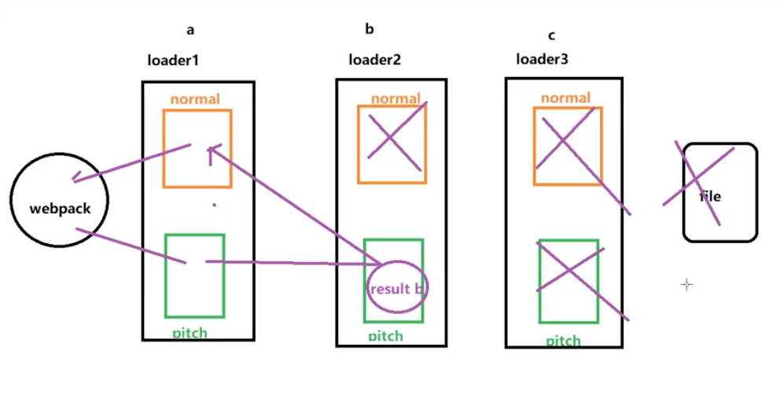

# loader

+ 所谓 loader 只是一个导出为函数的 JavaScript 模块。它接收上一个 loader 产生的结果或者资源文件(resource file)作为入参。也可以用多个 loader 函数组成 loader chain
+ compiler 需要得到最后一个 loader 产生的处理结果。这个处理结果应该是 String 或者 Buffer（被转换为一个 string）

## webpack 运行的总体流程


## 1. loader-runner

loader-runner是一个执行 loader 链条的的模块

### 1.1 loader 类型

loader得分类有4种，它们的组合是有顺序的

loader 的叠加顺序 = post(后置)+inline(内联)+normal(正常)+pre(前置)

loader的分类跟loader自己没有关系的，跟使用的时候有关系，默认的是正常模式

为什么要给loader分类？ 因为我们的loader配置可以是由多个配置文件合并而来，为了保证执行的时候按我们希望的顺序来执行，所以我们給loader进行一个分类

### 1.2 loader使用流程

```js
//  runner.js
const { runLoaders } = require("loader-runner");
const path = require("path");
const fs = require("fs"); //webpack-dev-server启开发服务器的时候 memory-fs
const entryFile = path.resolve(__dirname, "src/index.js");
//如何配置行内
let request = `inline-loader1!inline-loader2!${entryFile}`;
let rules = [
  {
    test: /\.js$/, // 正常模式
    use: ["normal-loader1", "normal-loader2"],
  },
  {
    test: /\.js$/,
    enforce: "post",
    use: ["post-loader1", "post-loader2"],
  },
  {
    test: /\.js$/,
    enforce: "pre",
    use: ["pre-loader1", "pre-loader2"],
  },
];
// 处理内联模式
let parts = request.replace(/^-?!+/, "").split("!");
let resource = parts.pop(); //弹出最后一个元素 entryFile=src/index.js
let inlineLoaders = parts; //[inline-loader1,inline-loader2]
// 处理另外3种模式
let preLoaders = [],
  postLoaders = [],
  normalLoaders = [];
for (let i = 0; i < rules.length; i++) {
  let rule = rules[i];
  if (rule.test.test(resource)) {
    if (rule.enforce === "pre") {
      preLoaders.push(...rule.use);
    } else if (rule.enforce === "post") {
      postLoaders.push(...rule.use);
    } else {
      normalLoaders.push(...rule.use);
    }
  }
}
let loaders = [
  ...postLoaders,
  ...inlineLoaders,
  ...normalLoaders,
  ...preLoaders,
];
let resolveLoader = (loader) =>
  path.resolve(__dirname, "loaders-chain", loader);
//把loader数组从名称变成绝对路径
loaders = loaders.map(resolveLoader);
runLoaders(
  {
    resource, //你要加载的资源
    loaders, // 资源文件需要经过哪些loader处理
    context: { name: "zhufeng", age: 100 }, //保存一些状态和值
    readResource: fs.readFile.bind(this), // 读文件的方法
  },
  (err, result) => {
    console.log(err); //运行错误
    console.log(result); //运行的结果
    console.log(
      result.resourceBuffer ? result.resourceBuffer.toString("utf8") : null
    ); //读到的原始的文件 resourceBuffer存放的是二进制字节
  }
);
```

## 1.3 loader的特殊配置

+ !!: noAutpPrePost
+ !: noAuto
+ -!: noPreAuto

## 1.4 pitch

+ 比如 a!b!c!module, 正常调用顺序应该是 c、b、a，但是真正调用顺序是 a(pitch)、b(pitch)、c(pitch)、c、b、a,如果其中任何一个 pitching loader 返回了值就相当于在它以及它右边的 loader 已经执行完毕
+ 比如如果 b 返回了字符串"result b", 接下来只有 a 会被系统执行，且 a 的 loader 收到的参数是 result 

+ loader 根据返回值可以分为两种，一种是返回 js 代码（一个 module 的代码，含有类似 module.export 语句）的 loader，还有不能作为最左边 loader 的其他 loader
+ 有时候我们想把两个第一种 loader chain 起来，比如 style-loader!css-loader! 问题是 css-loader 的返回值是一串 js 代码，如果按正常方式写 style-loader 的参数就是一串代码字符串
+ 为了解决这种问题，我们需要在 style-loader 里执行 require(css-loader!resources)

pitch 与 loader 本身方法的执行顺序图


## 2. 实现babel-loader.js

```js
npm i @babel/preset-env @babel/core -D
```

```js
const core = require("@babel/core");
const path = require("path");
function loader(source) {
  let filename = this.resourcePath.split(path.sep).pop();
  let options = this.getOptions();
  let loaderOptions = {
    ...options,
    sourceMaps: true, //我会基于上一个份sourcemap生成自己的sourcemap
    filename,
  };
  //code转译后的代码 源代码和转译后的代码的映射文件 抽象语法树
  let { code, map, ast } = core.transformSync(source, loaderOptions);
  //如果想往 下一个loader传递多个值，可以使用this.callback,它是同步的
  this.callback(null, code, map, ast);
}
module.exports = loader;
/**
 * babel-loader只是提供一个转换函数，但是它并不知道要干啥要转啥
 * @babel/core 负责把源代码转成AST，然后遍历AST，然后重新生成新的代码
 * 但是它并不知道如何转换语换法，它并不认识箭头函数，也不知道如何转换
 * @babel/transform-arrow-functions 插件其实是一个访问器，它知道如何转换AST语法树
 * 因为要转换的语法太多，插件也太多。所以可一堆插件打包大一起，成为预设preset-env
 */
```

要想在项目中使用自定义loader
1. 可以使用绝对路径 path.resolve(__dirname,'loader/babel-loader.js')
2. resolveLoader 配置alias
3. resolveLoader 配置modules

```js
resolveLoader: {
    alias: {
      "babel-loader": path.resolve(__dirname, "loader/babel-loader.js"),
    },
    modules: [path.resolve("./loader"), "node_modules"],
},
module: {
    rules: [
      {
        test: /\.js$/,
        exclude: /node_modules/,
        use: {
          loader: "babel-loader",
          options: {
            presets: ["@babel/preset-env"],
          },
        },
      },
    ]
}
```