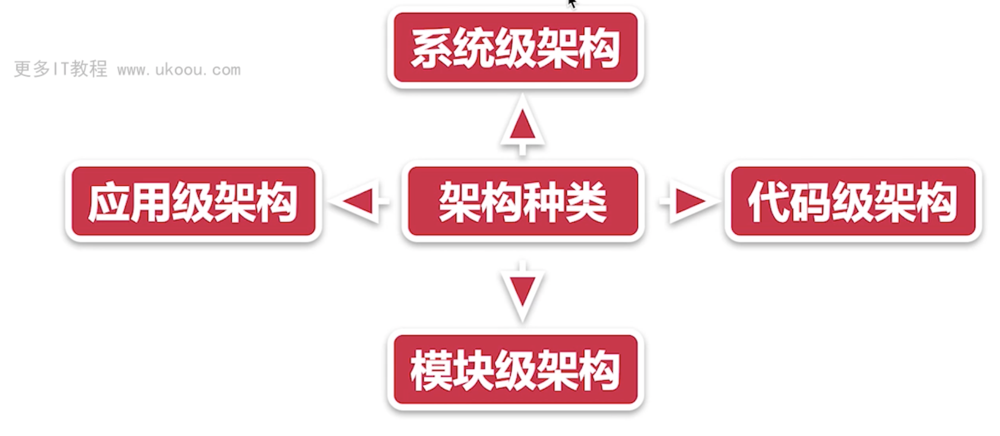

# 软件工程设计原则 - solid原则

## 1. 单一职责原则

## 2. 开放封闭原则

软件实体拓展应该是开放的，但是对于修改应该是封闭的

理解： 对拓展开放，对修改封闭， 可以去拓展类，但是不要去修改类

应用： 当需求有所改动的时候，尽量用继承或者组合的方式来拓展类的功能，而不是直接修改类的代码

## 3. 里氏替换原则

理解：父类一定会被子类所替换

## 4. 最少知识原则

只与你最直接的对象交流

也就是`高内聚，低耦合`

做系统设计的过程中，尽量减少依赖关系

## 5. 接口隔离原则

一个类与另一个类之间的依赖性，应该依赖于尽可能小的接口

不要对外暴露没有意义的接口，用户不应该依赖他不需要的接口

当应用需要对外暴露接口的时候，如果是非必要对外暴露，那就应该进行删除

## 6. 依赖倒置原则

理解：应该面向接口编程，而不是面向实现类编程

# 补充设计原则

## 1. 组合/聚合复用原则

扩展类的时候，首先考虑的是组合，其次才是继承，组合优于继承

## 2. 无环依赖原则

A依赖B、B依赖C、C依赖A

解决办法：中间层方式

## 3. 共同封装原则

应该将易变的类放在同一个包里，将变化隔离出来

## 4. 共用重用原则

如果重用了包中的一个类，那么就相当于重用类包中的所有的类，我们要尽可能的减少包中的大小

## 5. 好莱坞原则

依赖注入

## 6. 不要重复你自己

封装重复的代码

## 7. 保持简单和傻瓜

系统界面简洁、功能实用、操作方便

## 8. 高内聚、低耦合

## 9. 关注点分离

分而治之

## 10. 你不需要它

不要过度设计，系统足够简单，但是不能失去拓展性

# 软件系统分层

## 1. 系统架构设计

应用在整个系统内部如何与后台服务进行通信，与第三方系统如何集成

设计的首要条件：了解前端系统与其他系统之间的关系

关系包括：业务关系和协作机制

设计与后端的通讯机制，api设置、

前端和后端的关系考虑的主要因素是：前后端分离的架构设计

前后端分离架构在于如何实施技术决策，用户鉴权，API接口管理与设计、API文档管理、Mock的使用、BFF层（服务于前端的后端，node.js）,是否需要服务器端渲染等

## 微前端

在一个系统内微前端是应用间的架构方案

在多个应用之间，微前端则是一种系统间的机构方案

微前端其实是将多个前端应用以某种形式结合在一起进行应用

解决的问题：单体应用在一个相对时间长的跨度下应用带来不可维护的问题

微前端分为：

1. 单实例：同一个时刻只有一个子应用被展示，子应用应该具备一个完整的应用生命周期
2. 多实例：通常基于Url的变化来进行子应用的切换

通常使用web Components方案来做子应用的封装，子应用更像是一个业务组件而不是一个应用

## 应用级架构

应用级架构可以看作是系统级架构的细化

1. 脚手架
2. 模式库
3. 设计系统
   
## 模块级架构

迭代过程，模块设计

## 代码级架构

开发流程，代码质量，规范流程